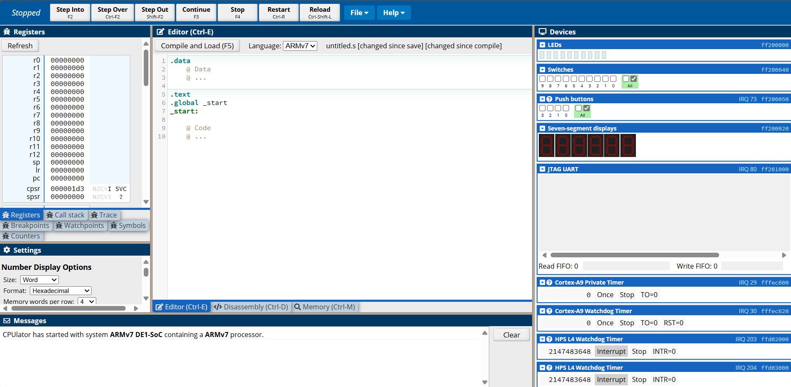
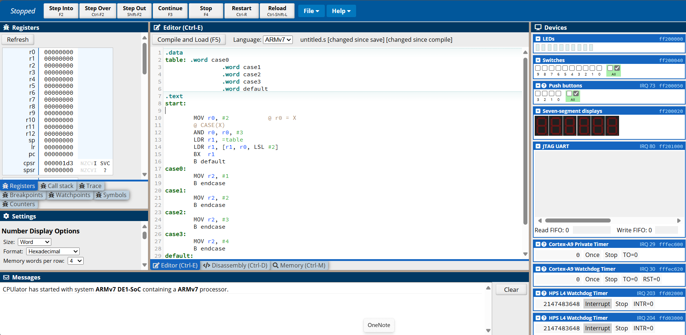
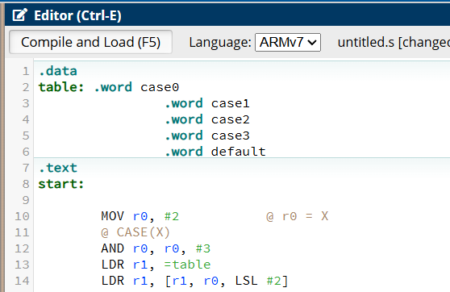
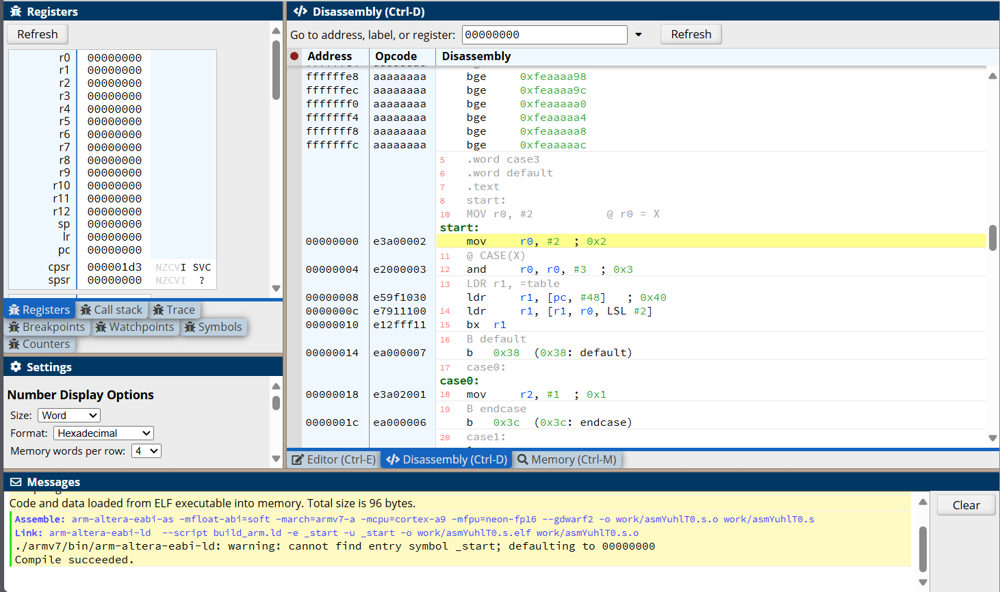
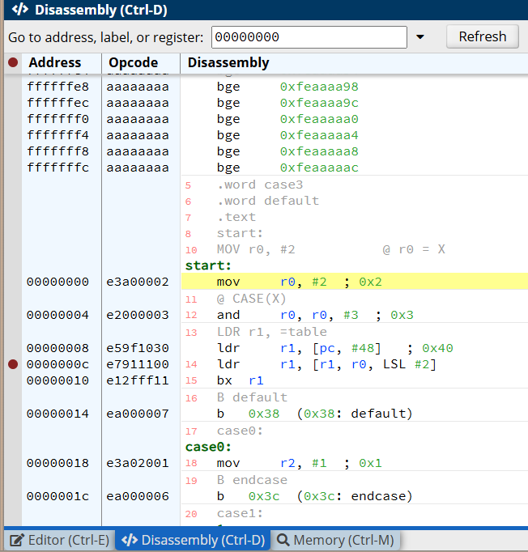
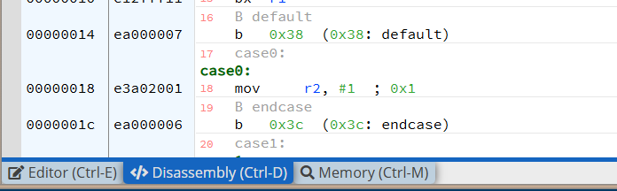
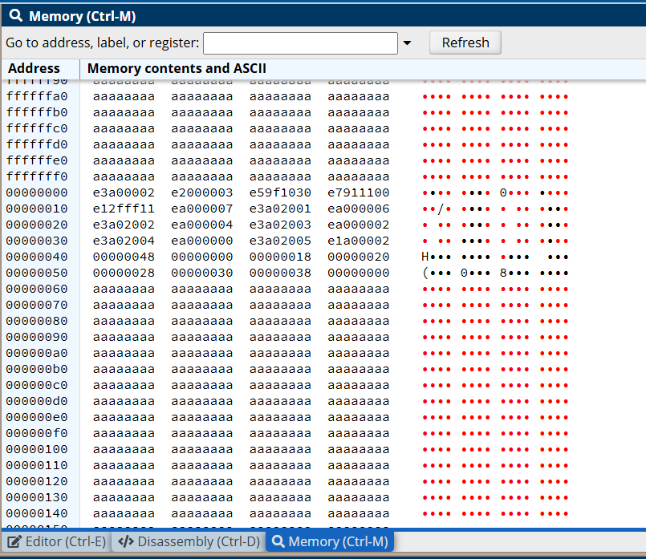
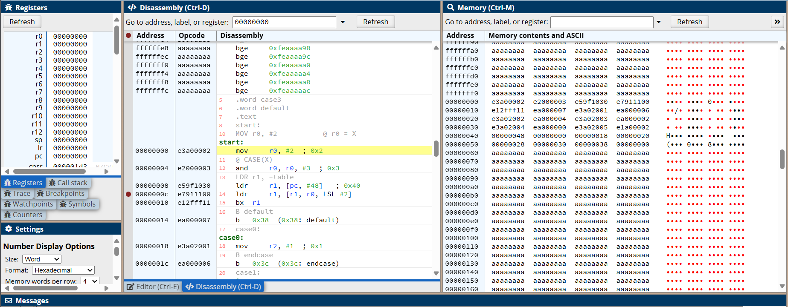
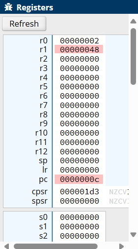

# A.1 Einführung
## 1.5.2 CPUlator: Einführung in CPUlator

Um Code im Simulator auszuführen, wird dieser zunächst als Text in das Editor-Feld eingefügt. 

Das `.text`-Segment enthält den Programmcode, der auf die Daten im `.data`-Segment zugreifen kann. 

Diese Segmente werden im Editor durch sogenannte Direktiven festgelegt, spezielle Anweisungen, die dem Assembler Informationen zur Struktur und Organisation des Programms geben. Einzeilige Kommentare werden mit `@` oder `//` eingeleitet und helfen, den Code besser verständlich zu machen.

Nun wurde ein Beispielcode zu Demonstrationszwecken in den Editor eingefügt.

Um diesen Code auszuführen, muss er zuerst assembliert werden. Assemblieren bedeutet, dass der Quellcode in Textform in Maschinencode umgewandelt wird. 
Dies geschieht im CPUlator, indem man auf die Schaltfläche "Compile and Load" drückt. Dabei wird der Code nicht nur assembliert, sondern auch in den Speicher des Simulators geladen, sodass er ausgeführt werden kann.

Nach erfolgreicher Assemblierung erscheint eine Erfolgsmeldung im Message-Feld. In diesem Message-Feld würden auch Fehlermeldungen angezeigt werden. 
Es lohnt sich also, dieses Feld stets im Blick zu behalten, um mögliche Fehler schnell erkennen und beheben zu können.

Nach dem erfolgreichen Assemblierungsvorgang wechselt der Simulator automatisch vom Editor-Reiter zum Disassembler-Reiter. 
In diesem Reiter gibt es mehrere Spalten: links befindet sich eine Spalte für Breakpoints, daneben werden die Adressen angezeigt, gefolgt von den Maschinenbefehlen und ganz rechts sind die entsprechenden Assemblerbefehle sowie Kommentare zu sehen. 

Für die Ausführung des Codes, gibt es oben auf der Website mehrere Schaltflächen, die relevant sind:

**Step Into:** Führt die Instruktionen schrittweise aus, sodass jede einzelne Anweisung nacheinander ausgeführt wird.

**Continue:** Setzt die Programmausführung fort, bis ein Breakpoint erreicht wird. 

**Stop:** Hält die Programmausführung an, wenn sie im Modus "Continue" läuft.

**Restart:** Setzt die Programmausführung zurück und startet das Programm von vorne.

**Reload:** Lädt das Programm erneut in den Speicher, falls Änderungen vorgenommen oder das Programm neu gestartet werden soll.

Breakpoints setzt man, indem man links neben die gewünschte Anweisung klickt.
Dies ermöglicht es, die Programmausführung gezielt an bestimmten Stellen zu unterbrechen, um den Zustand des Programms zu überprüfen und Fehler gezielt zu debuggen.

Die Fenster Editor, Disassembly und Memory können per Drag-and-Drop so angeordnet werden, dass sie gleichzeitig sichtbar sind.

Am linken Rand der Website befindet sich eine Ansicht der CPU-Register. 

Hier kann man in Echtzeit verfolgen, wie sich die Registerwerte während der Ausführung von Instruktionen ändern, was hilfreich ist, um Fehler zu identifizieren.

|-------------------|-------------------------------|---------------------------------------|
| [zurück](erste.md)| [Hauptmenü](../ueberblick.md) | [weiter](../Datentransfer/datentr.md) | 

| **1.5 CPUlator**                                                                          |
|-------------------------------------------------------------------------------------------|
| [1.5.1 Erste Schritte in Assembler](../CPUlator/erste.md)                                 |
| [1.5.2 Einführung in CPUlator](../CPUlator/cpulator.md)                                   |