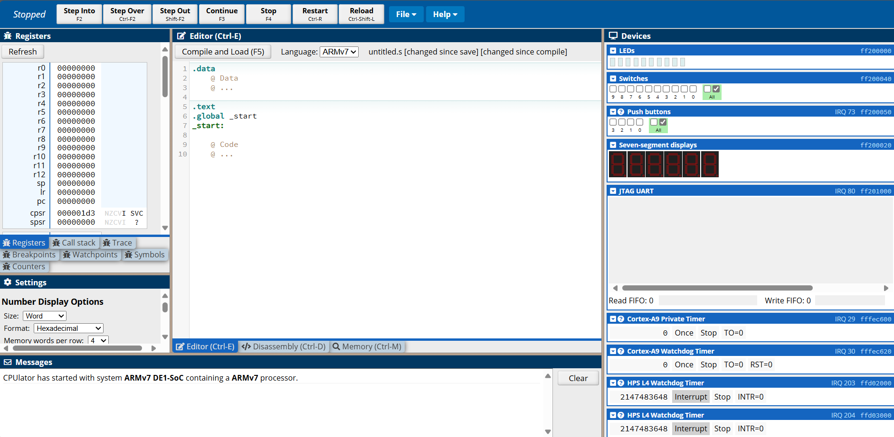
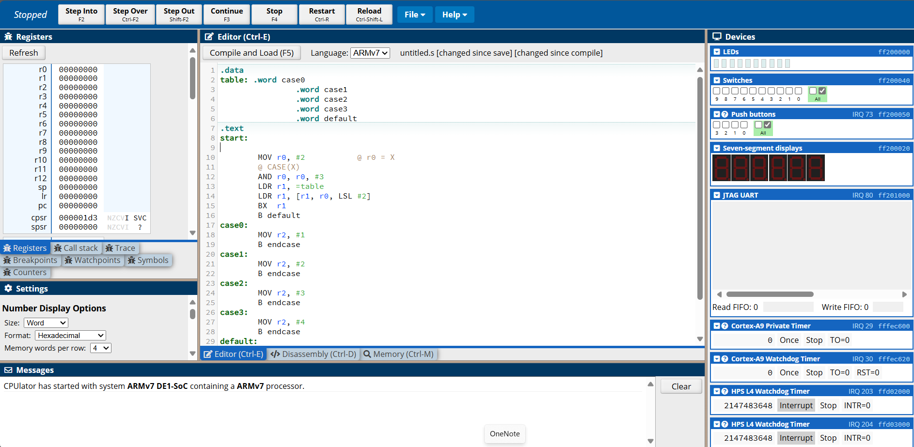
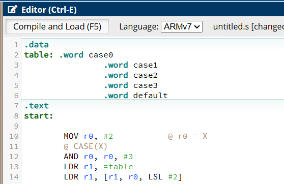
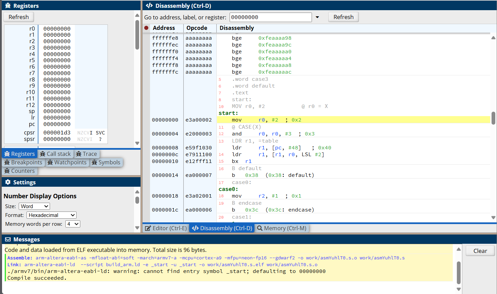
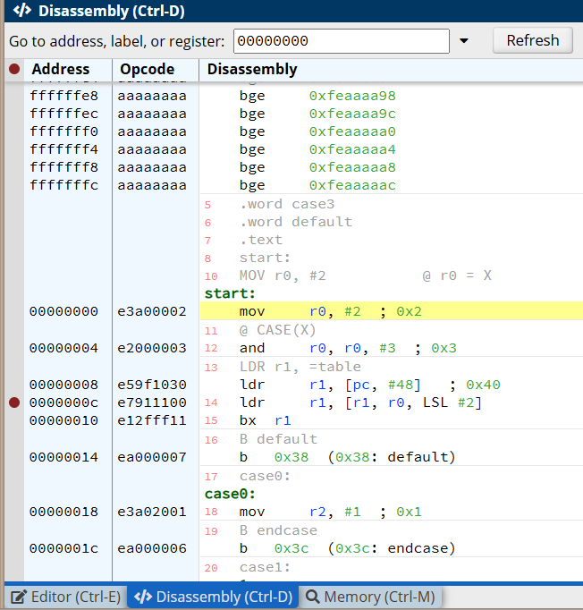
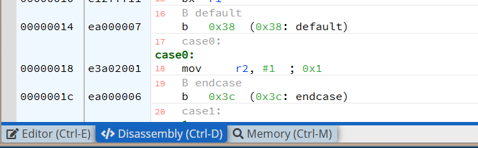
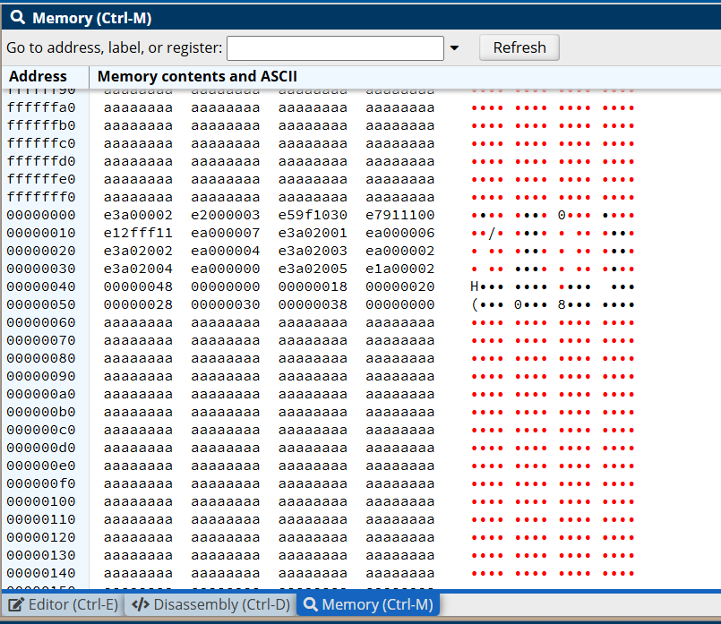
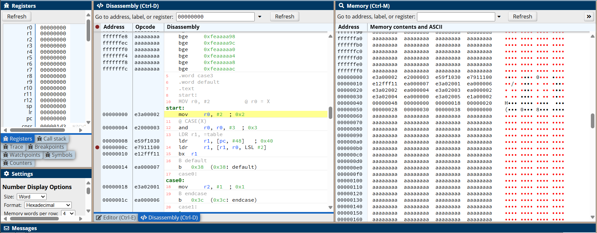
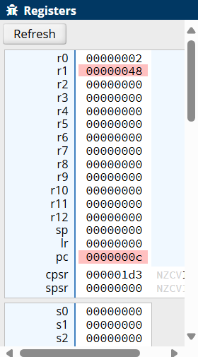

## Einführung in CPUlator

Um Code im Simulator auszuführen, wird dieser zunächst als Text in das Editor-Feld eingefügt. 

Eine wichtige Assembler-Direktive, die dabei verwendet wird, ist **.data**, mit der der Datenbereich deklariert wird. Im **.data**-Segment wird kein ausführbarer Code abgelegt. Stattdessen enthält es Daten, wie Variablen, Konstanten oder andere Informationen, die während der Programmausführung benötigt werden. Diese Daten sind entscheidend für die korrekte Funktion des Programms und werden im Speicher abgelegt, sodass der ausführbare Code später darauf zugreifen kann.
Im Gegensatz dazu enthält das **.text**-Segment den ausführbaren Code des Programms. Der Code, der nach der **.text**-Direktive eingefügt wird, ist der eigentliche Programmcode, der vom Prozessor ausgeführt wird. Dieser ausführbare Code kann auf die im **.data**-Segment gespeicherten Daten zugreifen, um Berechnungen durchzuführen oder Entscheidungen zu treffen. 
Die klare Trennung zwischen dem .data-Segment, das die Daten speichert, und dem .text-Segment, das den ausführbaren Code enthält, ist essenziell für das Verständnis der Assemblerprogrammierung.
Kommentare im Code können entweder mit "@" oder "//" eingeleitet werden. Kommentare sind zu empfehlen, um den Code oder die Daten verständlicher und damit wartbarer zu gestalten.

Nun wurde ein Beispielcode zu Demonstrationszwecken in den Editor eingefügt.

Um diesen Code auszuführen, muss er zuerst assembliert werden, das heißt, der Quellcode in Textform wird in Maschinencode umgewandelt. Dies geschieht, indem man auf die Schaltfläche "Compile and Load" drückt. Dabei wird der Code nicht nur assembliert, sondern auch direkt in den Speicher des Simulators geladen, sodass er unmittelbar ausgeführt werden kann.

Wenn der Assemblierungsvorgang erfolgreich war, erscheint eine entsprechende Erfolgsmeldung im Message-Feld. In diesem Feld würden auch Fehlermeldungen angezeigt, sei es während der Assemblierung oder bei Problemen, die während der Ausführung des Codes auftreten. Es lohnt sich also, das Message-Feld auch während des Debuggings im Blick zu behalten, um mögliche Fehler schnell zu erkennen und zu beheben.

Nach dem Assemblierungsvorgang wechselt der Simulator automatisch vom Editor-Fenster zum Disassembler-Fenster. In diesem Fenster gibt es mehrere Spalten: links befindet sich eine Spalte für Breakpoints, daneben werden die Adressen angezeigt, gefolgt von den Maschinenbefehlen, und ganz rechts sind die entsprechenden Assemblerbefehle sowie eventuelle Kommentare zu sehen. 

Für die Ausführung des Codes, gibt es oben auf der Website mehrere Schaltflächen, die relevant sind:

**Step Into:** Führt die Instruktionen schrittweise aus, sodass jede einzelne Anweisung nacheinander ausgeführt wird.

**Continue:** Setzt die Programmausführung fort, bis ein Breakpoint erreicht wird. 

**Stop:** Hält die Programmausführung an, wenn sie im Modus "Continue" läuft.

**Restart:** Setzt die Programmausführung zurück und startet das Programm von vorne.

**Reload:** Lädt das Programm erneut in den Speicher, falls Änderungen vorgenommen oder das Programm neu gestartet werden soll.

Um einen Breakpoint zu setzen, klickt man einfach in der äußersten linken Spalte auf die Höhe der Anweisung, bei der man das Programm anhalten möchte. Dies ermöglicht es, die Programmausführung gezielt an bestimmten Stellen zu unterbrechen, um den Zustand des Programms zu überprüfen und Fehler gezielt zu debuggen.

Die Fenster Editor, Disassembly und Memory können per Drag-and-Drop so angeordnet werden, dass sie gleichzeitig sichtbar sind.

Am linken Rand der Website befindet sich eine Ansicht der CPU-Register. 

Hier kann man in Echtzeit verfolgen, wie sich die Registerwerte während der Ausführung von Instruktionen ändern, was hilfreich ist, um Fehler zu identifizieren.

|-------------------|-------------------------------|---------------------------------------|
| [zurück](erste.md)| [Hauptmenü](../ueberblick.md) | [weiter](../Datentransfer/datentr.md) | 
