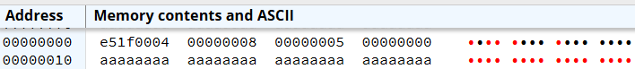
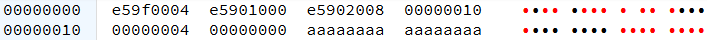
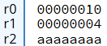
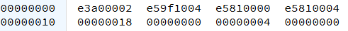
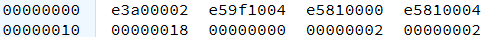
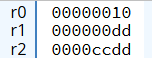
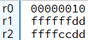
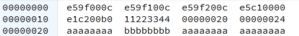
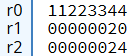
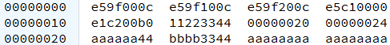

# A.2 Basic Blocks implementieren
## 2.1.4 Datentransfer zwischen Register und Speicher

Neben dem Datentransfer zwischen Registern kann es notwendig sein, Daten zwischen einem Register und dem Hauptspeicher auszutauschen. Für diese Art des Datentransfers gibt es in ARM-Assembler Load und Store-Befehle. Bei diesen Befehlen (LDR/STR) gibt es unterschiedliche Adressierungsarten.

### Der LDR-Befehl
Der **LDR-Befehl** steht für "Load Register" und wird verwendet, um Daten von einer Adresse im Speicher in ein Register zu laden. Hierbei gibt es mehrere Möglichkeiten, wie man ein Register laden kann:

#### 1. Laden der Speicheradresse
##### Syntax:
```
LDR <Zielregister>, =label  
```
Wenn `"label"` eine Speicheradresse (also der Name einer Speicherstelle oder eines Labels) ist, dann wird der Befehl `LDR <Zielregister>, =label` so interpretiert, dass die Speicheradresse von `label` in das angegebene Register geladen wird.

##### Beispiel:
```
.data
var1: .word 5

.text
.global _start
_start:
    LDR R0, =var1    @ Lade die Adresse von var1 in R0
```

##### Erklärung des Codes: 
- ***.data:*** Im Segment **.data** wird kein ausführbarer Code abgelegt. Stattdessen enthält dieses Segment Daten, die im Speicher gespeichert werden und vom Programm während seiner Ausführung verwendet werden. Diese Daten können Variablen, Konstanten oder andere Informationen umfassen, die das Programm benötigt, um korrekt zu funktionieren.
Im Gegensatz dazu enthält das **.text**-Segment den ausführbaren Code des Programms. Hier können dann die Daten aus dem Segment **.data** benötigt werden.
- ***var1:***  Dies ist ein Label für eine Variable oder Datenstelle im Speicher. Labels werden verwendet, um auf bestimmte Adressen im Speicher zuzugreifen.
- ***.word 5:*** Der **.word**-Befehl weist den Assembler an, eine 32-Bit-Ganzzahl (Wort) mit dem Wert 5 zu speichern. Die Größe der gespeicherten Daten ist plattformabhängig, aber ArmV7 entspricht .word einer 4-Byte (32-Bit) Zahl.

**Bedeutung:** In diesem Beispiel wird eine Variable namens var1 erstellt, die auf eine bestimmte Speicheradresse zeigt. An dieser Adresse wird der 32-Bit-Wert 5 gespeichert. Das Label var1 dient dazu, diese Speicheradresse im Programm zu referenzieren, sodass der Wert 5 gelesen oder modifiziert werden kann.

- ***LDR R0, =var1***: Hier wird die Speicheradresse, auf die das Label var1 zeigt, in das Register R0 geladen. Dies bedeutet, dass nach der Ausführung dieses Befehls das Register R0 die Adresse von var1 enthält, nicht den Wert 5 selbst.

##### Speicherstruktur:
Um das besser zu verstehen, schauen wir uns den Speicher nach Ausführung des Codes in CPULator an:

 

- Jede Speicheradresse ist 4 Bytes (bzw. 32 Bits) groß.
- Wenn die erste Speicheradresse, an der Daten abgelegt werden, zum Beispiel 0x00000000 ist, dann ist die nächste verfügbare Speicheradresse 0x00000004, gefolgt von 0x00000008 und so weiter. Man zählt also immer in 4-Byte-Schritten (32-Bit) hoch.

In unserem Beispiel wird der Wert 5 an der Speicheradresse 0x08 abgelegt, da der Speicher um 4 Bytes für jedes Wort weitergezählt wird. Somit sollte nach der Ausführung von `LDR R0, =var1` im Register `R0` die Speicheradresse `0x08` stehen, da `var1` auf diese Adresse mit dem gespeicherten Wert `5` zeigt. Aber Achtung: Die Speicheradresse kann sich immer ändern, heißt in der nächsten 

Hier kann man dieses Ergebnis in CPULator sehen:

 

#### 2. Laden eines Wertes
##### Syntax:
```
LDR <Zielregister>, [<Quellregister>, #Offset]
```
Diese Anweisung lädt den Wert aus dem Speicher, dessen Adresse im `<Quellregister>` gespeichert ist, in das `<Zielregister>`. Wenn ein #Offset angegeben wird, wird die Speicheradresse im Quellregister um den Offsetwert erhöht, und der Wert, der an der daraus resultierenden Speicheradresse steht, wird ins Zielregister geladen.
**Achtung:** Als Offset kann auch ein Registerwert und kein Immediatwert stehen 

##### Beispiel:
```
.data
var1: .word 4

.text
.global _start
_start:
    LDR R0, =var1       @ Lade die Adresse von var1 in R0
    LDR R1, [R0]        @ Lade den Wert aus der Adresse in R0 in R1
    LDR R2, [R0, #8]    @ Lade den den Wert in R0 + 8 in R2
```
**Nach der Ausführung:**
- R0 enthält die Adresse von var1.
- R1 enthält den Wert 4, der an der Adresse gespeichert ist, auf die R0 zeigt.
- Die Speicheradresse wird um 8 erhöht. In R0 wurde die Speicheradresse 0x10 gespeichert, nach der Erhöhung durch den Offset erhält man als Wert für die Speicheradresse 0x18.
- Der Wert, der in Speicheradresse 0x18 steht, wird in R2 gespeichert.

**So sieht der Speicher nach der Ausführung des Codes in CPULator aus:**



**So sehen die Register nach der Ausführung aus:**



Wie man hier erkennen kann, wurde der Wert 0xaaaaaaaa aus der Speicheradresse 0x18 in R2 gespeichert.

### Der ADR-Pseudo-Befehl
Die **ADR-Pseudo-Instruktion** (Address to Register) dient dazu, die Adresse eines Labels direkt in ein Register zu laden, indem eine PC-relative Adressierung genutzt wird. **ADR** berechnet die Zieladresse basierend auf der aktuellen Position des **Programmzählers** (PC) und speichert diese im angegebenen Register.

#### Syntax 
```
ADR <Zielregister>, <Label>
```

Der Assembler berechnet den Offset zwischen der aktuellen Position des PC und der Adresse des Labels. Diese berechnete Adresse wird in das Zielregister geladen. Der Befehl wird in eine Instruktion übersetzt, die den PC-Wert mit dem Offset addiert oder subtrahiert

Der Assembler übersetzt diese Instruktion dann wie folgt: 
```
ADD <Zielregister>, <PC-Wert>, #Offset
```

Oder 

```
SUB <Zielregister>, <PC-Wert>, #Offset
```

### Der STR-Befehl
Der **STR-Befehl** steht für "Store Register" und wird verwendet, um den Inhalt eines Registers in den Speicher zu schreiben. Er speichert den Wert eines Registers an einer angegebenen Speicheradresse.

##### Syntax:
```
STR <Quellregister>, [Zielregister, #Offset]  
```
Der Wert aus dem `<Quellregister>` wird in die Speicheradresse von dem `<Zielregister>` gespeichert. Bei einem `#Offset` wird die Speicheradresse des Zielregisters um den Offsetwert erhöht. Der Wert im Quellregister wird dann in die Speicheradresse geschrieben, die sich aus der Addition der Speicheradresse des Zielregisters und dem Offsetwert ergibt.

##### Beispiel:
```
.data
var1: .word 4

.text
.global _start
_start:
    MOV R0, #2          
    LDR R1, =var1      
    STR R0, [R1]        
    STR R0, [R1, #4]
```
- In Register R0 wird der Wert 2 gespeichert
- Register R1 wird mit der Speicheradresse von var1 geladen
- Mit der ersten STR-Anweisung wird der Wert 2, der in Register R0 steht, an der Speicheradresse von R1 (bzw. Speicheradresse von var1) gespeichert.
- Mit der zweiten STR-Anweisung wird der Wert 2, der in Register 0 steht, in die Speicheradresse geschrieben, die sich aus der Addition der Speicheradresse von R1 und dem Wert 4 ergibt.

Um das besser zu verstehen, schauen wir uns den Speicher vor und nach Ausführung des STR-Befehls an:

**Vor Ausführung des STR-Befehls:**

 

Wie im Bild zu erkennen ist, wurde die 4 in die Speicheradresse 0x18 gespeichert. Die Speicheradresse wurde in Register R1 geladen.

**Nach Ausführung des STR-Befehls:**

 

Hier erkennt man, dass in der Speicheradresse 0x18 (die in R1 geladen wurde) jetzt nicht mehr die 4 steht, sondern durch den ersten STR-Befehl der Wert 2 (der im Register R0 steht) gespeichert wurde. Mit dem zweiten STR-Befehl wurde der Wert 2 in die Speicheradresse 0x22 geschrieben. Diese Speicheradresse ergibt sich aus der Speicheradresse 0x18 und dem Offsetwert #4.

### Speichern und Laden Halbwörtern und Bytes
Während STR und LDR für 32-Bit-Werte (Wörter) verwendet werden, ermöglichen die Befehle STRB, LDRB, STRH und LDRH das Arbeiten mit kleineren Datenmengen wie Bytes (8 Bit) und Halbwörtern (16 Bit). Im Folgenden werden diese Befehle näher erläutert:

#### 1. STRB - Store Byte
##### Syntax:
```
STRB <Quellregister>, [<Zielregister>, #Offset]
```
Mit `<STRB>` wird das niederwertigste Byte (die unteren 8 Bits) aus dem `<Quellregister>` in die Speicheradresse des `<Zielregisters>` gespeichert. Wenn ein #Offset angegeben wird, wird die Speicheradresse um diesen Wert erhöht, bevor der Byte-Wert gespeichert wird.

#### 2. LDRB - Load Byte
##### Syntax:
```
LDRB <Zielregister>, [<Quellregister>, #Offset]
```
Der `<LDRB>`-Befehl lädt ein Byte (8 Bit) des Wertes aus dem Speicher, dessen Adresse im `<Quellregister>` gespeichert ist, in das `<Zielregister>`. Wenn ein #Offset angegeben wird, wird die Speicheradresse im Quellregister um den Offsetwert erhöht, und die unteren 8 Bits des Wertes, der an der daraus resultierenden Speicheradresse steht, werden in das Zielregister geladen.

#### 3. STRH - Store Halfword
##### Syntax:
```
STRH <Quellregister>, [<Zielregister>, #Offset]
```
Mit `<STRH>` wird niederwertigste Halfword (die unteren 16 Bits) aus dem `<Quellregister>` in die Speicheradresse des `<Zielregisters>` gespeichert. Wenn ein #Offset angegeben wird, wird die Speicheradresse um diesen Wert erhöht, bevor das Halfword gespeichert wird.

#### 4. LDRH - Load Halfword
##### Syntax:
```
LDRH <Zielregister>, [<Quellregister>, #Offset]
```
Der `<LDRH>`-Befehl lädt ein Halfword (16 Bits) des Wertes aus dem Speicher, dessen Adresse im `<Quellregister>` gespeichert ist, in das `<Zielregister>`. Wenn ein #Offset angegeben wird, wird die Speicheradresse im Quellregister um den Offsetwert erhöht, und die unteren 16 Bits des Wertes, der an der daraus resultierenden Speicheradresse steht, werden in das Zielregister geladen.

#### 5. LDRSH und LDRSB - Load Signed Halfword/Byte
##### Syntax:
```
LDRSH <Zielregister>, [<Quellregister>, #Offset]

LDRSB <Zielregister>, [<Quellregister>, #Offset]
```
Die Befehle `<LDRSH>` und`<LDRSB>` laden jeweils ein 16-Bit-Halbworte oder ein 8-Bit-Byte aus dem Speicher und erweitern das Vorzeichen auf 32 Bit, um negative Werte korrekt darzustellen, wobei `<LDRSH>` für Halbworte und `<LDRSB>` für Bytes verwendet wird.  

#### Beispiele:
##### LDRB und LDRH:
```
.data
var1: .word 0xaabbccdd  @ Lade das Word 0xaabbccdd

.text
.global _start
_start:
    LDR R0, =var1	@ Lade die Adresse von var1 in R0
    LDRB R1, [R0]	@ Lade die unteren 8 Bits des Wertes aus der Adresse von R0 in R1
    LDRH R2, [R0]	@ Lade die unteren 16 Bits des Wertes aus der Adresse von R0 in R1
```

**So sehen die Register R1 und R2 nach Ausführung aus:**

 

In diesem Beispiel wurde das Wort `0xaabbccdd` an der Speicheradresse `0x10` abgelegt. Diese Speicheradresse wurde dann in das Register `R0` geladen. Durch den `LDRB`-Befehl wurde das unterste Byte des Wertes, also `0xdd`, in `R1` geladen. Anschließend hat der `LDRH-Befehl` das unterste Halbwort des Wertes, also `0xccdd`, in `R2` geladen.

##### LDRSB und LDRSH:
```
.data
var1: .word 0xaabbccdd  @ Lade das Word 0xaabbccdd

.text
.global _start
_start:
    LDR R0, =var1	@ Lade die Adresse von var1 in R0
    LDRSB R1, [R0]	@ Lade die unteren 8 Bits des Wertes aus der Adresse von R0 in R1, fülle die vorderen Stellen mit einsen auf
    LDRSH R2, [R0]	@ Lade die unteren 16 Bits des Wertes aus der Adresse von R0 in R1, fülle die vorderen Stellen mit einsen auf
```

**So sehen die Register R1 und R2 nach Ausführung aus:**

 

In diesem Beispiel wurde das Wort `0xaabbccdd` an der Speicheradresse `var1` abgelegt. Diese Speicheradresse wurde dann in das Register `R0` geladen. Durch den `LDRSB`-Befehl wurde das unterste Byte des Wertes, also `0xdd`, in `R1` geladen, wobei die höheren 24 Bits auf 1 gesetzt wurden, um das Vorzeichen korrekt zu setzen. Anschließend hat der `LDRSH`-Befehl das unterste Halbwort des Wertes, also `0xccdd`, in `R2` geladen, wobei die höheren 16 Bits auf 1 gesetzt wurden, um das Vorzeichen korrekt zu setzen.

##### STRB und STRH:
```
.data
var1: .word 0xaaaaaaaa  @ Lade das Word 0xaaaaaaaa
var2: .word 0xbbbbbbbb  @ Lade das Word 0xbbbbbbbb


.text
.global _start
_start:
    LDR R0, =0x11223344   @ Lade das Word 0x11223344 in das Register R0
    LDR R1, =var1         @ Lade die Adresse von var1 in R1
    LDR R2, =var2         @ Lade die Adresse von var2 in R2
    STRB R0, [R1]         @ Speichere das unterste Byte von R1 in die Speicheradresse in R0
    STRH R0, [R2]         @ Speichere das unterste Halfword von R1 in die Speicheradresse in R0
```

**So sieht der Speicher vor der Ausführung aus:**

 

**So sehen die Register und der Speicher nach der Ausführung aus:**

 

- In Register R0 wurde der Wert `0x11223344` gespeichert 
- var1 ist auf `0xaaaaaaaa` gesetzt und wurde in die Speicheradresse `0x20` gespeichert
- var2 ist auf `0xbbbbbbbb` gesetzt und wurde in die Speicheradresse `0x24` gespeichert
Diese Speicheradressen wurden jeweils einmal in Register `R1` und einmal in Register `R2` gespeichert.

 

|------------------------|-------------------------------|-------------------------------------------|
| [zurück](Immediates.md)| [Hauptmenü](../ueberblick.md) | [weiter](../Sektionen_Label/sektionen.md) |


| **2.1 Datentransfer**                                                                     |
|-------------------------------------------------------------------------------------------|
| [2.1.1 Datentransfer in Assembler](datentr.md)                                            |
| [2.1.2 Datentransfer zwischen Registern und Transfer von direkten Werten](MOV.md)         |
| [2.1.3 Immediate-Werte in ARM-Assembler](Immediates.md)                                   |
| [2.1.4 Datentransfer zwischen Register und Speicher](LDR_STR.md)                          |
