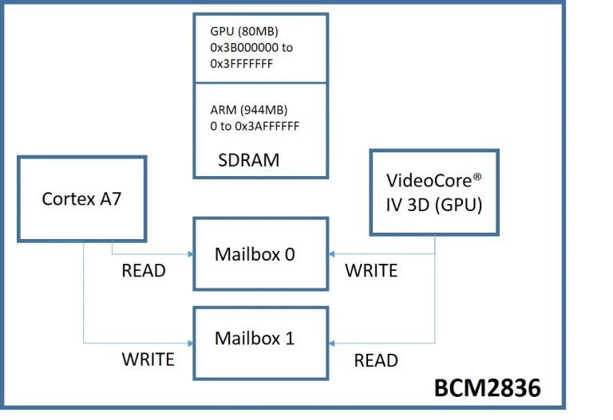

# B.2 Erweiterungen der CPU-Funktionalität
## 2.4.4 Grafik & GPU: Kommunikation mittels Mailbox
Um über die Mailbox zwischen GPU und CPU Daten austauschen zu können werden zunächst zwei Funktionen benötigt. Eine, um damit der ARM-Prozessor Daten senden kann, MailboxWrite - und eine weitere, damit er Daten in Empfang nehmen kann, MailboxRead.



### MailboxWrite: Sende Nachricht an Mailbox 1
Der Absender wartet, bis das Statusfeld im most significant Bit eine 0 anzeigt. Anschließend schreibt der Absender seine Mail in das Schreibregister (MAILBOX_WRITE), wobei die unteren 4 Bits die Nummer des Kanals angeben, in den geschrieben werden soll, und die oberen 28 Bits die Nachricht enthalten, die gesendet werden soll.

### MailboxRead: Lese Nachricht von Mailbox 0
Der Empfänger wartet, bis das Statusfeld im 30. Bit eine 0 anzeigt. Danach liest der Empfänger aus dem Leseregister. Anschließend überprüft er, ob die Nachricht für das richtige Postfach bestimmt ist. Ist dies nicht der Fall, wiederholt er den Vorgang.

### Fehlerbehandlung
Zudem ist es ratsam eine Fehlerbehandlung vorzunehmen, bei der sich die Funktionen bei Problemen vorzeitig beenden, indem sie mit einem Fehlercode als Rückgabewert zur Rücksprungadresse zurückkehren.


### Implementierung von Mailboxwrite & Mailboxread

Der folgende Code implementiert die Funktionen zur Kommunikation zwischen CPU und GPU über die Mailbox:

- **`MailboxWrite`**: Schreibt eine Nachricht in die GPU-Mailbox.
- **`MailboxRead`**: Liest eine Nachricht aus der GPU-Mailbox.

**Speichern Sie diesen Code in `gpu_mail.s`**

#### Deklarationen und Definitionen

```assembly
.global MailboxWrite
.global MailboxRead

.section .text

.equ MailboxBaseAdr, 0x3f00b880
.equ MB_READ, 0x00
.equ MB_STATUS_WRITE, 0x38
.equ MB_WRITE, 0x20
.equ MB_STATUS_READ, 0x18

.equ channel_mask, 0x0f
.equ MAIL_FULL, 0x80000000
.equ MAIL_EMPTY, 0x40000000
```

Die globalen Symbole `MailboxWrite` und `MailboxRead` werden deklariert, sodass sie von anderen Modulen oder Funktionen aufgerufen werden können. 

Mehrere Konstanten werden mit `.equ` definiert. `MailboxBaseAdr` gibt die Basisadresse der Mailbox-Register an, die für die Kommunikation mit der GPU bei `0x3F00B880` liegt. Die Offsets `MB_READ`, `MB_STATUS_WRITE`, `MB_WRITE` und `MB_STATUS_READ` spezifizieren die Positionen der entsprechenden Register für das Lesen, Schreiben und Statusabfragen.

Die Maske `channel_mask` dient dazu, die unteren 4 Bits zu verwenden, um die Kanalnummer festzulegen. Mit `MAIL_FULL` wird eine Bitmaske (`0x80000000`) definiert, die anzeigt, ob die Mailbox voll ist und somit keine Daten geschrieben werden können. `MAIL_EMPTY` ist eine weitere Bitmaske (`0x40000000`), die verwendet wird, um festzustellen, ob die Mailbox leer ist, bevor Daten gelesen werden können.

#### Funktion `MailboxWrite`

```assembly
MailboxWrite:
    push    {lr}
    tst     r0, #channel_mask
    bne     error_exit
    cmp     r1, #channel_mask
    bhi     error_exit
    mov     r2, r0
    ldr     r0, =#MailboxBaseAdr
wait_write:
    ldr     r3, [r0, #MB_STATUS_WRITE]
    tst     r3, #MAIL_FULL
    bne     wait_write
wait_write_end:
    add     r2, r1
    str     r2, [r0, #MB_WRITE]
    pop     {pc}
```

**Erläuterung der Funktion `MailboxWrite`:**

Das Link-Register wird zunächst gesichert, um die Rücksprungadresse nach dem Funktionsaufruf wiederherstellen zu können. Anschließend erfolgt eine Validierung der Eingabeparameter. Zuerst wird überprüft, ob die Kanalbits der Nachricht in `r0` korrekt sind. Die unteren 4 Bits müssen Null sein, andernfalls springt die Funktion zur Fehlerbehandlung. Die Kanalnummer, die in `r1` übergeben wird, wird ebenfalls geprüft, um sicherzustellen, dass sie innerhalb des gültigen Bereichs der unteren 4 Bits liegt. Ist einer der Werte ungültig, verzweigt die Funktion ebenfalls zur Fehlerbehandlung.

Nach der Validierung wird die Nachricht aus `r0` in `r2` kopiert, und die Basisadresse der Mailbox-Register wird in `r0` geladen. Anschließend geht die Funktion in eine Warteschleife, die so lange aktiv bleibt, bis die Mailbox bereit zum Schreiben ist. Diese Prüfung erfolgt durch das Lesen des Mailbox-Statusregisters und dem Testen des `MAIL_FULL`-Bits. Solange die Mailbox voll ist, bleibt die Schleife aktiv.

Sobald die Mailbox zum Schreiben bereit ist, wird die Kanalnummer zu der Nachricht in `r2` hinzugefügt, wobei die Kanalnummer korrekt in die unteren 4 Bits eingefügt wird. Diese kombinierte Nachricht wird dann in das Schreibregister der Mailbox geschrieben. Schließlich wird das Link-Register wiederhergestellt, und die Funktion kehrt zur aufrufenden Funktion zurück.

#### Fehlerbehandlung in `MailboxWrite`

```assembly
error_exit:
    mov      r1, #1
    pop      {pc}
```

Im Fall eines Fehlers wird `r1` auf den Wert `1` gesetzt, um einen Fehlercode zu signalisieren. Anschließend wird das Link-Register vom Stack wiederhergestellt, und die Funktion kehrt mit `pop {pc}` zum Aufrufer zurück. Dies zeigt an, dass während der Ausführung ein Fehler aufgetreten ist, indem der Fehlercode über `r1` übermittelt wird.

#### Funktion `MailboxRead`

```assembly
MailboxRead:
    push    {lr}
    cmp     r0, #channel_mask
    bhi     error_exit
    mov     r1, r0
    ldr     r0, =#MailboxBaseAdr
wait_read:
    ldr     r2, [r0, #MB_STATUS_READ]
    tst     r2, #MAIL_EMPTY
    bne     wait_read
wait_read_end:
    ldr     r2, [r0, #MB_READ]
    and     r3, r2, #channel_mask
    teq     r3, r1
    bne     wait_read
right_channel:
    and      r0, r2, #0xfffffff0
    pop      {pc}
```

Das Link-Register wird gesichert, und die Kanalnummer in `r0` mit der Kanalmaske verglichen. Ist die Kanalnummer ungültig, erfolgt ein Sprung zur Fehlerbehandlung.

Die Kanalnummer wird in `r1` kopiert, und die Basisadresse der Mailbox-Register in `r0` geladen. Anschließend geht die Funktion in eine Warteschleife, bis die Mailbox Daten zum Lesen bereitstellt. Solange das `MAIL_EMPTY`-Bit gesetzt ist, bleibt die Funktion in der Schleife.

Sobald Daten vorhanden sind, wird die Nachricht aus dem Leseregister geladen und die Kanalnummer extrahiert. Stimmt sie nicht überein, wird weitergewartet. Bei Übereinstimmung wird die Nachricht bereinigt, indem die unteren 4 Bits entfernt werden. Die Funktion kehrt schließlich mit der bereinigten Nachricht in `r0` zur aufrufenden Funktion zurück und stellt das Link-Register wieder her.

#### Fehlerbehandlung in `MailboxRead`

```assembly
error_exit:
    mov      r1, #1
    pop      {pc}
```

Im Fall eines Fehlers wird `r1` auf den Wert `1` gesetzt, um einen Fehlercode zu signalisieren. Anschließend wird das Link-Register vom Stack wiederhergestellt, und die Funktion kehrt mit `pop {pc}` zur aufrufenden Funktion zurück. Dies zeigt an, dass während der Ausführung ein Fehler aufgetreten ist, und über den Fehlercode in `r1` wird dies dem Aufrufer mitgeteilt.


|--------------------------|-------------------------------|-----------------------------|
| [zurück](gpubcm2836.md)  | [Hauptmenü](../ueberblick.md) | [weiter](framebuff.md)      |


|**2.4 Grafik & GPU**                                                       |
|---------------------------------------------------------------------------|
| [2.4.1 Einführung in die Computergrafik & RGB565-Format](grafikintro.md)  |
| [2.4.2 Was ist eine GPU?](gpuintro.md)                                    |
| [2.4.3 Die GPU des BCM2836 VideoCoreIV](gpubcm2836.md)                    |
| [2.4.4 Kommunikation mittels Mailbox](kommb.md)                           |
| [2.4.5 Der Framebuffer und seine Nutzung](framebuff.md)                   |
| [2.4.6 Der Framebuffer-Mailbox-Kanal](framemailb.md)                      |
| [2.4.7 Senden der Initialisierungsnachricht](sendinit.md)                 |