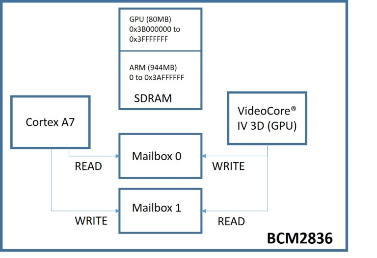

## Kommunikation mittels Mailbox
Um über die Mailbox zwischen GPU und CPU Daten austauschen zu können werden zunächst zwei Funktionen benötigt. Eine, um damit der ARM-Prozessor Daten senden kann, MailboxWrite - und eine weitere, damit er Daten in Empfang nehmen kann, MailboxRead.

### MailboxWrite: Sende Nachricht an Mailbox 1
Der Absender wartet, bis das Statusfeld im most significant Bit eine 0 anzeigt. Anschließend schreibt der Absender seine Mail in das Schreibregister (MAILBOX_WRITE), wobei die unteren 4 Bits die Nummer des Kanals angeben, in den geschrieben werden soll, und die oberen 28 Bits die Nachricht enthalten, die gesendet werden soll.

### MailboxRead: Lese Nachricht von Mailbox 0
Der Empfänger wartet, bis das Statusfeld im 30. Bit eine 0 anzeigt. Danach liest der Empfänger aus dem Leseregister. Anschließend überprüft er, ob die Nachricht für das richtige Postfach bestimmt ist. Ist dies nicht der Fall, wiederholt er den Vorgang.

### Fehlerbehandlung
Zudem ist es ratsam eine Fehlerbehandlung vorzunehmen, bei der sich die Funktionen bei Problemen vorzeitig beenden, indem sie mit einem Fehlercode als Rückgabewert zur Rücksprungadresse zurückkehren.

|--------------------------|-------------------------------|-----------------------------|
| [zurück](gpubcm2836.md)  | [Hauptmenü](../ueberblick.md) | [weiter](framebuff.md)      |