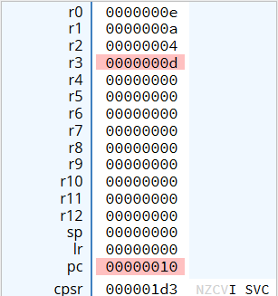

## Arithmetische Instruktionen
### ADD
Der ADD-Befehl wird verwendet, um zwei Werte zu addieren und das Ergebnis in ein Register zu speichern.

#### Syntax
Die grundlegende Syntax des ADD-Befehls lautet wie folgt:

```
ADD <Zielregister>, <Quellregister>, <Quelle>
```
Hierbei ist `<Zielregister>` das Register, in das das Ergebnis der Addition gespeichert wird. Auf den Wert, der im `<Quellregister>` steht, wird ein anderer Wert (`<Quelle>`) addiert, der entweder in einem anderen Register steht oder ein unmittelbarer Wert sein kann.

Achtung: Es ist nicht möglich, zwei unmittelbare Werte direkt miteinander zu addieren!


#### Beispiele

1. **Addition zweier Register**
```
ADD Rd, Rn, Rm
```
In diesem Beispiel wird der Wert von `Rn` mit dem Wert von `Rm` addiert, das Ergebnis wird dann in `Rd` gespeichert.

2. **Addition mit einem unmittelbaren Wert**

```
ADD Rd, Rn, #imm
```
Hier wird der Wert von `Rn` mit dem unmittelbaren Wert `#imm` addiert, das Ergebnis wird dann in `Rd` gespeichert.

#### Anwendungsbeispiel

```
    MOV R1, #5       @ Lade den Wert 5 in Register R1
    MOV R2, #10      @ Lade den Wert 10 in Register R2
    ADD R0, R1, R2   @ Addiere R1 und R2, speichere das Ergebnis in R0
    ADD R3, R1, #3   @ Addiere den Wert 3 auf R1, speichere das Ergebnis in R3
```

**So sehen nach Ausführung die Register aus:**




### SUB
Der SUB-Befehl wird verwendet, um einen Wert von einem anderen zu subtrahieren und das Ergebnis in ein Register zu speichern.

#### Syntax
Die grundlegende Syntax des SUB-Befehls lautet wie folgt:

```
SUB <Zielregister>, <Quellregister>, <Quelle>
```
Hierbei ist `<Zielregister>` das Register, in das das Ergebnis der Subtraktion gespeichert wird, <Quellregister> ist das Register, von dem subtrahiert wird, und <Quelle> ist ein Register, dessen Wert subtrahiert wird. `<Quelle>` kann aber genauso wieder ein unmittelarer Wert sein!
Bei SUB gelten die selben Regeln wie bei ADD: Man darf keine unmittelbaren Werte voneinander subtrahieren und ein Registerwert kann nicht von einem unmittelbaren Wert subtrahiert werden! 

#### Beispiele
1. **Subtraktion zweier Register**
```
SUB Rd, Rn, Rm
```
In diesem Beispiel wird der Wert von `<Rm>` von dem Wert von `<Rn>` subtrahiert. Das Ergebnis wird in `<Rd>` gespeichert.

2. **Subtraktion eines unmittelbaren Wertes**
```
SUB Rd, Rn, #imm
```
Hier wird der unmittelbare Wert `<#imm>` von dem Wert in `<Rn>` subtrahiert, das Ergebnis wird dann in `<Rd>` gespeichert.

#### Anwendungsbeispiele


```

    MOV R0, #10      @ Lade den Wert 10 in Register R0
    MOV R1, #4       @ Lade den Wert 4 in Register R1
    SUB R2, R0, R1   @ Subtrahiere R1 von R0, speichere das Ergebnis in R2
    SUB R3, R0, #5   @ Subtrahiere den Wert 5 von R0, speichere das Ergebnis in R3
```    
#### Folgende Beispiele zeigen, wie man SUB nicht anwenden kann:
```    
    SUB R4, #8, #3   @ Das Subtrahieren von zwei unmittelbaren Werten ist nicht erlaubt
    SUB R5, #9, R1   @ Ein Registerwert kann nicht von einem unmittelbaren Wert subtrahiert werden
```


### MUL
Der MUL-Befehl wird verwendet, um zwei Werte zu multiplizieren und das Ergebnis in ein Register zu speichern.

#### Syntax
Die grundlegende Syntax des MUL-Befehls lautet wie folgt:

```
MUL <Zielregister>, <Quellregister1>, <Quellregister2>
```

Hierbei ist ``<Zielregister>`` das Register, in das das Ergebnis der Multiplikation gespeichert wird, ``<Quellregister1>`` und ``<Quellregister2>`` sind die Register, deren Werte multipliziert werden.
Achtung: Bei `MUL` können keine unmittelbaren Werte verwendet werden!

#### Anwendungsbeispiele

```
    MOV R0, #3       @ Lade den Wert 3 in Register R0
    MOV R1, #7       @ Lade den Wert 7 in Register R1
    MUL R2, R0, R1   @ Multipliziere R0 und R1, speichere das Ergebnis in R2
```

####  Folgende Beispiele zeigen, wie man MUL nicht anwenden kann:
```
    MUL R3, #3, #4   @ Unmittelbare Werte dürfen bei MUL nicht angewendet werden!
    MUL R4, R0, #3
    MUL R5, #2, R1
```


### MLA (Multiply-Accumulate)

Der MLA-Befehl wird verwendet, um zwei Werte zu multiplizieren und das Ergebnis mit einem dritten Wert zu Addieren. Das resultierende Ergebnis wird in einem Register gespeichert.

#### Syntax
```
MLA <Zielregister>, <Quellregister1>, <Quellregister2>, <Additionsregister>
```

Zuerst werden die Werte, die in `<Quellregister1>` und `<Quellregister2>` gespeichert sind, miteinander multipliziert. Anschließend wird das Ergebnis der Multiplikation mit dem Wert aus dem `<Additionsregister>` addiert. Das Endergebnis wird in das `<Zielregister>` gespeichert.
Achtung: Auch bei `MLA` können keine unmittelbaren Werte verwendet werden!


#### Anwendungsbeispiele

```
    MOV R0, #2   			@ Lade den Wert 2 in Register R0        
    MOV R1, #7 				@ Lade den Wert 7 in Register R1 
	MOV R2, #1				@ Lade den Wert 1 in Register R2 
	MLA R3, R0, R1, R2		@ Multipliziere R0 und R1, addiere R2, speichere das Ergebnis in R3
    						@ R3 = (R0 * R1) + R2 = (2 * 7) + 1 = 15
```
####  Folgendes Beispiel zeigt, wie man MLA nicht anwenden sollte:
```asm
    MLA R4, #3, R1, R2      @ Fehler: Unmittelbare Werte dürfen bei MLA nicht verwendet werden!
```


### UDIV und SDIV

Die Befehle UDIV und SDIV werden verwendet, um Divisionen durchzuführen, wobei UDIV für vorzeichenlose Division und SDIV für vorzeichenbehaftete Division verwendet wird.
**Achtung: In diesen beiden Instruktionen dürfen keine unmittelbaren Werte verwendet werden!**

#### Syntax
```
UDIV <Zielregister>, <Dividendregister>, <Divisorregister>

SDIV <Zielregister>, <Dividendregister>, <Divisorregister>
```

- `UDIV (Unsigned Divide)`: Führt eine Division von zwei vorzeichenlosen (unsigned) 32-Bit-Werten durch. Das Ergebnis wird im `<Zielregister>` gespeichert.
- `SDIV (Signed Divide)`: Führt eine Division von zwei vorzeichenbehafteten (signed) 32-Bit-Werten durch. Das Ergebnis wird im `<Zielregister>` gespeichert.

**Hinweis:** Diese Instruktionen werden nicht von allen Prozessoren der ARMv7-Familie unterstützt und sind auch im CPUlator nicht ausführbar. Da jedoch in einem späteren Abschnitt des Tutorials auf einen Emulator umgestiegen wird, der die ARMv7-A-Variante unterstützt, wird an dieser Stelle bereits auf diese Befehle hingewiesen, da sie äußerst nützlich sind.

[zurück](arithlogintro.md) [Hauptmenü](../index.md) [weiter](comp.md)