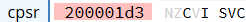
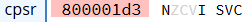
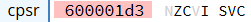
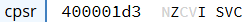
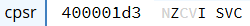

# A.2 Basic Blocks implementieren
## 2.3.6 Datenverarbeitung: Vergleichsoperatoren
Vergleichsoperatoren sind grundlegende Werkzeuge in Assembler, die verwendet werden, um Werte in Registern zu vergleichen, um auf der Grundlage dieser Vergleiche Entscheidungen zu treffen. 
Im Gegensatz zu anderen Befehlen speichern Vergleichsoperatoren kein Resultat in einem Register. Stattdessen beeinflusst der Vergleich einzig die Statusflags, die im weiteren Programmverlauf für bedingte Anweisungen verwendet werden können.

### CMP

Der CMP-Befehl ("Compare") ist ein Vergleichsoperator, der zwei Registerwerte durch eine Subtraktion miteinander vergleicht und die Ergebnisflags entsprechend setzt. 

#### Syntax

```
CMP <RegisterA>, <RegisterB>
```

Der Befehl vergleicht den Wert in Register A mit dem in Register B, indem er die Differenz der beiden berechnet (Register A - Register B) und dient somit dazu, zu überprüfen, ob der Wert in Register A kleiner, größer oder gleich dem Wert in Register B ist.

#### Beispiel

```
MOV R0, #5
MOV R1, #4
CMP R0, R1   @ Erste CMP-Operation
CMP R1, R0   @ Zweite CMP-Operation
CMP R0, R0   @ Dritte CMP-Operation
```

In diesem Beispiel werden die Werte `5` und `4` in die Register `R0` und `R1` geladen. Anschließend werden die drei CMP-Operationen durchgeführt, die jeweils zwei Register miteinander vergleichen und die entsprechenden Flags im CPSR-Register setzen.

1. **Das CPSR nach der ersten CMP-Operation**
In dieser ersten CMP-Operation wird der Wert in R0 (5) mit dem Wert in R1 (4) verglichen. Der Befehl subtrahiert R1 von R0 (5 - 4 = 1). Da das Ergebnis positiv ist (größer als 0), wird die Negative Flag (N-Flag) nicht gesetzt. Das Zero Flag (Z-Flag) bleibt ebenfalls unverändert, da das Ergebnis nicht Null ist. Da es keinen Borrow/Unterlauf gibt, bleibt das Carry Flag (C-Flag, das 29. Bit im CPSR) gesetzt:

    

2. **Das CPSR nach der zweiten CMP-Operation**
Bei der zweiten CMP-Operation wird R0 (5) von R1 (4) subtrahiert (4 - 5 = -1). Da das Ergebnis negativ ist, wird die Negative Flag (N-Flag. das 31. Bit im CPSR) im CPSR gesetzt. Dies zeigt an, dass R1 kleiner als R0 ist. Das Zero Flag (Z-Flag) bleibt unverändert, und das Carry Flag (C-Flag) wird in diesem Fall nicht gesetzt, weil ein Borrow aufgetreten ist:

    

3. **Das CPSR nach der dritten CMP-Operation**
In der dritten CMP-Operation wird R0 (5) mit sich selbst verglichen (5 - 5 = 0). Da das Ergebnis null ist, wird die Zero Flag (Z-Flag, das 30. Bit im CPSR) im CPSR gesetzt. Die Negative Flag (N-Flag) bleibt unverändert, da das Ergebnis nicht negativ ist. Außerdem wird das Carry Flag (C-Flag, das 29. Bit im CPSR) gesetzt, weil kein Borrow aufgetreten ist:

    


### TST

Der TST-Befehl ("Test") ist ein logischer Vergleichsoperator, der zwei Registerwerte miteinander vergleicht, indem er eine bitweise UND-Operation durchführt. Dieser Vergleich überprüft durch das verunden, ob bestimmte Bits in den beiden Registern übereinstimmen. 

#### Syntax

```
TST <RegisterA>, <RegisterB>
```

Der Befehl führt eine bitweise UND-Operation zwischen den Werten in Register A und Register B durch. Basierend auf dem Ergebnis dieser Operation werden die entsprechenden Statusflags im CPSR-Register gesetzt.

#### Beispiel

```
MOV R0, #0b1010   
MOV R1, #0b0101   
TST R0, R1			       	
```

**Das CPSR nach der TST-Operation:**

Zuerst werden die Binärzahlen `1010` und `0101` in die Register `R0` und `R1` gespeichert. Anschließend wird durch die TST-Instruktion eine bitweise UND-Operation zwischen den beiden Registerwerten durchgeführt. Das Ergebnis dieser Operation ist `0000`, da keine der entsprechenden Bits in beiden Registern gleichzeitig 1 sind. Da das Ergebnis 0 ist, wird im CPSR-Register nur die `Zero Flag (Z-Flag)` gesetzt. Es bedeutet, dass die beiden Werte keine gemeinsamen gesetzten Bits haben.



### TEQ 

Der TEQ-Befehl ("Test Equivalence") ist ein logischer Vergleichsoperator, der zwei Registerwerte miteinander vergleicht, indem er eine bitweise Exklusiv-Oder-Operation (XOR) durchführt und die Flags entsprechend setzt. Somit überprüft TEQ, ob bestimmte Bits in den beiden Registern unterschiedlich sind.


#### Syntax

```
TEQ <RegisterA>, <RegisterB>
```

#### Beispiel

```
MOV R0, #0b1100   
MOV R1, #0b1100   
TEQ R0, R1			       	
```

**Das CPSR nach der TEQ-Operation:**

Zuerst werden die Binärzahlen `1100` und `1100` in die Register `R0` und `R1` geladen. Die TEQ-Instruktion führt eine bitweise XOR-Operation durch, bei der das Ergebnis `0000` ist, da beide Register identische Werte haben. Da das Ergebnis 0 ist, wird im CPSR-Register das `Zero Flag (Z-Flag)` gesetzt. Dies bedeutet, dass alle Bits in den beiden Registern übereinstimmen.



### Arithmetisch logische Operationen als Vergleichsoperatoren

Neben den spezifischen Vergleichsoperatoren wie **CMP**, **TST** und **TEQ** können auch arithmetische und logische Operationen in Assembler verwendet werden um Statusflags zu setzen. Dies geschieht durch das Hinzufügen eines S-Suffixes (z. B. ADDS, SUBS, ANDS). Diese Operationen führen wie gewohnt ihre Rechenoperationen durch und speichern das Ergebnis im Zielregister. Zusätzlich beeinflussen sie aber auch die Statusflags im CPSR-Register, was es ermöglicht, auf dem Ergebnis der Operation bedingte Sprünge oder Entscheidungen zu treffen.

#### Syntax
```asm
<Operation>S <Zielregister>, <RegisterA>, <RegisterB>
```
#### Beispiel
```
MOV R0, #5      
MOV R1, #3      
ADDS R2, R0, R1   @ Addition mit Flags
SUBS R3, R0, R1   @ Subtraktion mit Flags
```
**Erklärung der ADDS-Operation:**

Die ADDS-Instruktion addiert die Werte in R0 und R1 und speichert das Ergebnis in R2. Zusätzlich werden die Statusflags im CPSR gesetzt:

Da das Ergebnis 8 positiv ist, bleibt die Negative Flag unverändert.
Die Zero Flag bleibt ebenfalls unverändert, da das Ergebnis nicht null ist.
Falls das Ergebnis über den maximalen Wert hinausgeht (was hier nicht der Fall ist), würde die Carry Flag  gesetzt werden.

**Erklärung der SUBS-Operation:**

Die SUBS-Instruktion subtrahiert den Wert in R1 von R0 und speichert das Ergebnis in R3. Auch hier werden die Statusflags im CPSR aktualisiert:

Da das Ergebnis 2 positiv ist, wird die N-Flag nicht gesetzt.
Die Z-Flag bleibt unverändert, da das Ergebnis nicht null ist.
Die C-Flag bleibt gesetzt, weil kein Borrow aufgetreten ist.

Das **S-Suffix** kombiniert also die Möglichkeit Rechenoperationen durchzuführen, mit der Funktionalität von Vergleichsoperatoren, indem sie die Statusflags für spätere bedingte Anweisungen aktualisieren.

|-----------------------|------------------------------------|--------------------------|
|   [zurück](flags.md)  |   [Hauptmenü](../ueberblick.md)    |   [weiter](beding.md)    |


| **2.3 Datenverarbeitung**                                             |
|-----------------------------------------------------------------------|
| [2.3.1 Die ALU](arithlogintro.md)                                     |
| [2.3.2 Arithmetische Instruktionen](arithinstr.md)                    |
| [2.3.3 Logische Instrukionen](loginstr.md)                            |
| [2.3.4 Shift Operationen](shiftinstr.md)                              |
| [2.3.5 Das Statusregister](flags.md)                                  |
| [2.3.6 Vergleichsoperatoren](comp.md)                                 |
| [2.3.7 Bedingungscodes](beding.md)                                    |
| [2.3.8 Bedingte Instruktionsausführung](bedinstr.md)                  |