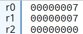
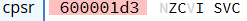
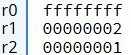
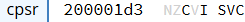

# A.2 Basic Blocks implementieren
## 2.3.5 Datenverarbeitung: Das Statusregister

Die Ergebnisse arithmetischer und logischer Operationen beeinflussen den Zustand der Flags, das sind spezielle Statusbits im Prozessor. 
Flags geben an, ob zum Beispiel das Ergebnis einer Berechnung Null war, ob ein Überlauf aufgetreten ist oder ob das Ergebnis negativ ist. Diese Flags sind entscheidend für die Kontrolle des Programmflusses, da sie die Grundlage für bedingte Sprünge und Entscheidungen im Programmablauf bilden. Somit sorgt die ALU durch ihre Operationen und die Nutzung von Flags für die korrekte Verarbeitung und Steuerung von Programmen.

### Das CPSR
Das **Current Program Status Register (CPSR)** in der ARMv7-Architektur ist ein spezielles Register, das wichtige Informationen über den Zustand des Prozessors speichert und steuert.

### Aufbau des CPSR Registers
Das CPSR-Register ist 32 Bit breit und in verschiedene Felder unterteilt, die jeweils unterschiedliche Informationen enthalten:
**Condition Flags (N, Z, C, V):** Diese Flags befinden sich in den oberen 4 Bits (Bits 31 bis 28) des Registers. Sie werden von arithmetischen und logischen Operationen beeinflusst und helfen dabei, den Zustand des Ergebnisses einer Berechnung zu bestimmen.
- **N (Negative Flag):** Dieses Flag wird gesetzt, wenn das Ergebnis der letzten arithmetischen Operation negativ war.
-  **Z (Zero Flag):** Dieses Flag wird gesetzt, wenn das Ergebnis der letzten Operation Null war.
-  **C (Carry Flag):** Das Carry-Flag zeigt an, ob bei einer arithmetischen Operation eine Über- oder Unterschreitung des Zahlenbereichs auftritt, wenn man Zahlen als unvorzeichenbehaftet (unsigned) betrachtet.
-  **V (Overflow Flag):** Das Overflow-Flag zeigt an, dass ein Überlauf bei vorzeichenbehafteten (signed) arithmetischen Operationen aufgetreten ist. Ein Überlauf tritt auf, wenn das Ergebnis einer Operation den zulässigen Zahlenbereich für vorzeichenbehaftete Zahlen überschreitet und somit das Vorzeichen des Ergebnisses falsch wird.


#### Übersicht der relevanten Bits des CPSR:

|  31  |  30  |  29  |  28  |  ... |
|------|------|------|------|------|
|   N  |   Z  |   C  |   V  |  ... |


### Setzen des CPSR (nur Condition Flags)
Das CPSR kann durch Anweisungen beeinflusst werden, die eine Berechnung durchführen und dabei die Condition Flags setzen. Dies wird erreicht, indem ein `s` am Ende der Operation angehängt wird. Diese erweiterte Syntax sorgt dafür, dass die entsprechenden Flags im CPSR basierend auf dem Ergebnis der Operation aktualisiert werden.

#### Beispiel-Syntax (mit bisher bekannten Anweisungen):
```
MOVS <Zielregister>, <Quelle>
ADDS <Zielregister>, <Quellregister>, <Quelle>
SUBS <Zielregister>, <Quellregister>, <Quelle>
MULS <Zielregister>, <Quellregister1>, <Quellregister2>
```

### Anwendungsbeispiele
#### Beispiel 1: Setzen des Zero-Flags (Z) und des Carry-Flags (C)
Nehmen wir an, dass zwei Register denselben Wert enthalten und diese Werte voneinander subtrahiert werden. In diesem Fall sollte das Ergebnis 0 sein, wodurch das Zero-Flag (Z) im CPSR-Register gesetzt wird.
```asm
MOV R0, #7       @ Lade den Wert 7 in Register R0
MOV R1, #7       @ Lade den Wert 7 in Register R1
SUBS R2, R0, R1  @ Subtrahiere R1 von R0, speichere das Ergebnis in R2 und setze die Flags
```
Nach der Operation SUBS zeigt das gesetzte Zero-Flag (Z) im CPSR an, dass das Ergebnis der Subtraktion Null war. Das Zero-Flag befindet sich im CPSR an Bit 30. Wenn das Ergebnis der Operation Null ist, wird dieses Bit auf 1 gesetzt. Betrachtet man das Ergebnis im CPU-Lator, so wird ersichtlich, dass auch das Carry-Flag (C) gesetzt wurde:

   
> Register R0, R1, R2 nach Ausführung


> CPSR nach Ausführung

Wenn man die oberen vier Bits (Bits 31 bis 28) des CPSR, die die Condition-Flags repräsentieren, nach dieser Operation binär darstellt, ergibt sich die Folge 0110 (in hexadezimal 0x6, wie auch in CPULator angezeigt). Dies bedeutet, dass das Zero-Flag (Bit 30) und das Carry-Flag (Bit 29) gesetzt sind.

Bei Subtraktionen zeigt die Carry-Flag an, dass kein **Borrow** (Untertrag) notwendig war. Ein Borrow tritt auf, wenn der **Minuend** (die Zahl, von der subtrahiert wird) **kleiner** ist als der **Subtrahend** (die abzuziehende Zahl).

**Achtung:** In der ARM-Architektur wird die **Carry-Flag** als **negierte Borrow-Flag** verwendet:
- Wenn das Carry-Flag gesetzt ist (**C = 1**), war die Subtraktion **ohne Borrow** möglich.
- Wenn das Carry-Flag nicht gesetzt ist (**C = 0**), war ein **Borrow erforderlich**.

Bei der Subtraktion **7-7** wird das Ergebnis **0** weshalb das Zero-Bit gesetzt wird. Dadurch, dass kein Unterlauf auftretet, wird das Carry-Bit auch auf **1** gesetzt. Bei der Subtraktion **7-10** wäre das Carry-Bit auf 0 gesetzt (aber auch das Zero-Bit, da das Ergebnis nicht 0 ist), da durch das abziehen einer größeren Zahl ein Untertrag entsteht.

#### Beispiel 2: Setzen des Carry-Flags (C) bei einer Addition

Wie im vorherigen Beispiel gezeigt wurde, wird das Carry-Bit bei einer Subtraktion **ohne** Untertrag gesetzt.  Bei der Addition ist es jedoch umgekehrt: Wenn es bei einer Addition zu einem Übertrag kommt, wird das Carry-Flag auf **1** gesetzt.. In diesem Beispiel addieren wir **2** zu **0xFFFFFFFF**, dem größten Wert, der im 32-Bit-Register dargestellt werden kann. Dies führt zu einem Überlauf: 

```
MOV R0, #0xFFFFFFFF     @ Register R0 wird mit 0xFFFFFFFF (alle 1er) geladen
MOV R1, #0x2            @ Lade den Wert 2 in Register R1
ADDS R2, R0, R1         @ Addiere R1 auf R0, speichere das Ergebnis in R2 und setze die Flags
```

So sieht das Ergebnis dann in CPULator aus:

   
> Register R0, R1, R2 nach Ausführung

So sieht die Unvorzeichenbehaftete Addition aus:

```
    11111111 11111111 11111111 11111111  (0xFFFFFFFF in Binär)
+   00000000 00000000 00000000 00000010  (0x2 in Binär)
--------------------------------------
(1) 00000000 00000000 00000000 00000001  (Ergebnis: 0x00000001)
```

Die Addition von 0xFFFFFFFF und 2 ergibt 0x00000001. Dies liegt daran, dass die größte Zahl in einem 32-Bit-System (0xFFFFFFFF) bei der Addition von 2 einen Überlauf (Carry) verursacht, der den Wert zurück auf 1 bringt. Die **1**, die sich im 32ten Bit ergeben würde, wird abgeschnitten, da das Resgistern nur eine Größe von 32 Bits hat (0-31tes Bit werden dargestellt).

So sieht das CPSR nach der Ausführung aus:

 

Wenn man die oberen vier Bits (Bits 31 bis 28) des CPSR, die die Condition-Flags repräsentieren, nach dieser Operation binär darstellt, ergibt sich die Folge 0010 (in hexadezimal 0x2, wie auch in CPULator angezeigt). Dies bedeutet, dass das Carry-Flag (Bit 29) wie erwartet gesetzt wurde.

|----------------------------|------------------------------------|------------------------|
|   [zurück](shiftinstr.md)  |   [Hauptmenü](../ueberblick.md)    |   [weiter](comp.md)    |


| **2.3 Datenverarbeitung**                                             |
|-----------------------------------------------------------------------|
| [2.3.1 Die ALU](arithlogintro.md)                                     |
| [2.3.2 Arithmetische Instruktionen](arithinstr.md)                    |
| [2.3.3 Logische Instrukionen](loginstr.md)                            |
| [2.3.4 Shift Operationen](shiftinstr.md)                              |
| [2.3.5 Das Statusregister](flags.md)                                  |
| [2.3.6 Vergleichsoperatoren](comp.md)                                 |
| [2.3.7 Bedingungscodes](beding.md)                                    |
| [2.3.8 Bedingte Instruktionsausführung](bedinstr.md)                  |