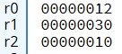
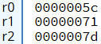
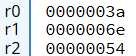
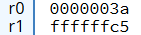

# A.2 Basic Blocks implementieren
## 2.3.3 Datenverarbeitung: Logische Instrukionen

### Die Logische Verundung mit AND
Der `AND`-Operator in ARMv7 führt eine bitweise logische UND-Operation zwischen zwei Werten durch. Dabei wird jedes Bit des ersten Operanden (in der Wahrheitstabelle A) mit dem entsprechenden Bit des zweiten Operanden (in der Wahrheitstabelle B) verglichen. Das Ergebnis ist nur dann 1, wenn beide Bits 1 sind. Andernfalls ist das Ergebnis 0.

#### Wahrheitstabelle für AND

|  A  |  B  |  Y  |
|-----|-----|-----|
|  0  |  0  |  0  |
|  0  |  1  |  0  |
|  1  |  0  |  0  |
|  1  |  1  |  1  |

#### Syntax
**AND (immediate):**
```
AND <Zielregister>, <RegisterA>, #imm
```
In dieser Variante wird der Wert, der in `Register A` gespeichert ist, mit einem unmittelbaren Wert (`#imm`) bitweise verundet. Das Ergebnis wird im `Zielregister` gespeichert.

**AND (register):**
```
AND <Zielregister>, <RegisterA>, <RegisterB>
```
Hier wird der Wert, der in `Register A` gespeichert ist, mit dem Wert in `Register B` bitweise verundet. Das Ergebnis wird in das `Zielregister` gespeichert.

#### Beispiel
``` 
MOV R0, #0x12       @ Speichere 0x12 in Register R0
MOV R1, #0x30       @ Speichere 0x30 in Register R1
AND R2, R0, R1      @ Bitweise Verundung der Werte in R0 und R1, Ergebnis wird in R2 gespeichert
```

**So sehen die Register in CPULator nach der Ausführung aus:**

 

**Darstellung der Bitweisen Verundung:**

Um das Ergebnis der bitweisen Verundung zu verdeutlichen, werden die Hexadezimalwerte `0x12` und `0x30` in ihre Binärform umgewandelt und die Operation durchgeführt:

```
    0001 0010 (0x12)
&   0011 0000 (0x30)    @ & = Zeichen für bitweise Verundung
--------------------
    0001 0000 (0x10)
```

Wie es hier ersichtlich ist, ergibt sich als Ergebnis der Verundung `0x10`. Dies liegt daran, dass nur die Bits, die in beiden Operanden an der gleichen Position 1 sind, im Ergebnis auf 1 gesetzt werden. Alle anderen Bits sind 0. (Vergleich: Wahrheitstabelle)

### Die Logische Verundung mit ORR
Der ORR-Operator führt eine bitweise logische ODER-Operation zwischen zwei Werten durch. Dabei wird jedes Bit des ersten Operanden (in der Wahrheitstabelle A) mit dem entsprechenden Bit des zweiten Operanden (in der Wahrheitstabelle B) verglichen. Das Ergebnis ist dann 1, wenn mindestens eines der beiden Bits 1 ist. Nur wenn beide Bits 0 sind, ist das Ergebnis 0.

#### Wahrheitstabelle für ORR

|  A  |  B  |  Y  |
|-----|-----|-----|
|  0  |  0  |  0  |
|  0  |  1  |  1  |
|  1  |  0  |  1  |
|  1  |  1  |  1  |

#### Syntax

**ORR (immediate):**
```
ORR <Zielregister>, <RegisterA>, #imm
```
In dieser Variante wird der Wert, der in `Register A` gespeichert ist, mit einem unmittelbaren Wert (`#imm`) bitweise verodert. Das Ergebnis wird im `Zielregister` gespeichert.

**ORR (register):**
```
ORR <Zielregister>, <RegisterA>, <RegisterB>
```
Hier wird der Wert, der in `Register A` gespeichert ist, mit dem Wert in `Register B` bitweise verodert. Das Ergebnis wird in das `Zielregister` gespeichert.

#### Beispiel
``` 
MOV R0, #0x5c       @ Speichere 0x5c in R0
MOV R1, #0x71       @ Speichere 0x71 in R1
ORR R2, R0, R1      @ Bitweise Veroderung der Werte in R0 und R1, Ergebnis wird in R2 gespeichert
```

**So sehen die Register in CPULator nach der Ausführung aus:**

 

**Darstellung der Bitweisen Veroderung:**

Um das Ergebnis der bitweisen Veroderung zu verdeutlichen, werden die Hexadezimalwerte `0x5c` und `0x71` in ihre Binärform umgewandelt und die Operation durchgeführt:

```
    0101 1100 (0x5c)
|   0111 0001 (0x71)    @ | = Zeichen für bitweise Veroderung
---------------------
    0111 1101 (0x7d)
```

Wie es hier ersichtlich ist, ergibt sich als Ergebnis der Veroderung `0x7d`. Dies liegt daran, dass das Ergebnis 1 ist, wenn mindestens eines der beiden Bits 1 ist. Alle anderen Bits werden entsprechend der ODER-Operation gesetzt. (Vergleich: Wahrheitstabelle)

### Die Logische Exklusive Veroderung mit EOR
Der EOR-Operator (Exclusive OR) in ARMv7 führt eine bitweise exklusive ODER-Operation zwischen zwei Werten durch. Dabei wird jedes Bit des ersten Operanden (in der Wahrheitstabelle A) mit dem entsprechenden Bit des zweiten Operanden (in der Wahrheitstabelle B) verglichen. Das Ergebnis ist dann 1, wenn die Bits unterschiedlich sind, also eines der Bits 1 und das andere 0 ist. Sind beide Bits gleich, ist das Ergebnis 0.

#### Wahrheitstabelle für EOR

|  A  |  B  |  Y  |
|-----|-----|-----|
|  0  |  0  |  0  |
|  0  |  1  |  1  |
|  1  |  0  |  1  |
|  1  |  1  |  0  |

#### Syntax

**EOR (immediate):**
```
EOR <Zielregister>, <RegisterA>, #imm
```
In dieser Variante wird der Wert, der in `Register A` gespeichert ist, mit einem unmittelbaren Wert (`#imm`) bitweise exklusiv verodert. Das Ergebnis wird im `Zielregister` gespeichert.

**EOR (register):**
```
EOR <Zielregister>, <RegisterA>, <RegisterB>
```
Hier wird der Wert, der in `Register A` gespeichert ist, mit dem Wert in `Register B` bitweise exklusiv verodert. Das Ergebnis wird in das `Zielregister` gespeichert.

#### Beispiel
```
MOV R0, #0x3a       @ Speichere 0x3a in R0
MOV R1, #0x6e       @ Speichere 0x6e in R1
EOR R2, R0, R1      @ Bitweise exklusive Veroderung der Werte in R0 und R1, Ergebnis wird in R2 gespeichert
```

**So sehen die Register in CPULator nach der Ausführung aus:**

 

**Darstellung der Bitweisen exklusiven Veroderung:**

Um das Ergebnis der bitweisen exklusiven Veroderung zu verdeutlichen, werden die Hexadezimalwerte `0x3a` und `0x6e` in ihre Binärform umgewandelt und die Operation durchgeführt:

```
    0011 1010 (0x3a)
^   0110 1110 (0x6e)    @ ^ = Zeichen für die exklusive Veroderung
---------------------
    0101 0100 (0x54)
```

Wie es hier ersichtlich ist, ergibt sich als Ergebnis der exklusive Veroderung `0x6e`.  Dies liegt daran, dass das Ergebnis 1 ist, wenn die Bits unterschiedlich sind (eines 1, das andere 0). Sind beide Bits gleich, ist das Ergebnis 0. (Vergleich: Wahrheitstabelle)

**Hinweis:** Mit der `EOR`-Verknüpfung lassen sich gezielt einzelne Bits invertieren, indem sie mit 1 exklusiv verodert werden. Bei einer EOR-Verknüpfung mit 0 bleiben die Bits unverändert. Dies wird im obigen Beispiel deutlich sichtbar.

### Die Logische Negation mit MVN
Der MVN-Operator (Move Not) in ARMv7 führt eine bitweise Negation (NOT-Operation) auf einen Wert durch. Dabei wird jedes Bit des Operanden invertiert, d.h. eine 1 wird zu 0 und 0 wird zu 1. Das Ergebnis wird dann in das Zielregister geschrieben.

#### Wahrheitstabelle für MVN

|  A  |  Y  |
|-----|-----|
|  0  |  1  |
|  1  |  0  |

#### Syntax

**MVN (immediate):**
```
MVN <Zielregister>, #imm
```
In dieser Variante wird ein unmittelbarer Wert (`#imm`) bitweise negiert. Das Ergebnis wird im `Zielregister` gespeichert.

**MVN (register):**
```
MVN <Zielregister>, <RegisterA>
```
Hier wird der Wert, der in `Register A` gespeichert ist, bitweise negiert. Das Ergebnis wird in das `Zielregister` geschrieben.

#### Beispiel
```
MOV R0, #0x3a       @ Speichere 0x3a in R0
MVN R1, R0          @ Bitweise Negierung des Wertes in R0, Ergebnis wird in R1 gespeichert
```

**So sehen die Register in CPULator nach der Ausführung aus:**

 

**Darstellung der Bitweisen Negierung:**

Um das Ergebnis der bitweisen Negierung zu verdeutlichen, wird der Hexadezimalwert `0x3a` in ihre Binärform umgewandelt und die Operation durchgeführt. Es ist wichtig zu beachten, dass alle 32 Bits negiert werden:

```
~   0000 0000 0000 0000 0000 0000 0011 1010 (0x3a)      @ ~ = Zeichen für Negierung
----------------------------------------------------------
    1111 1111 1111 1111 1111 1111 1100 0101 (0xffffffc5)
```

Wie hier ersichtlich ist, ergibt sich als Ergebnis der Negation `0xffffffc5`. Dies liegt daran, dass alle Bits des ursprünglichen Wertes invertiert wurden: `1` wird zu `0`, und `0` wird zu `1`. (Vergleich: Wahrheitstabelle)

|----------------------------|--------------------------------------|------------------------------|
|   [zurück](arithuelsg.md)  |    [Hauptmenü](../ueberblick.md)     |   [weiter](logue.md)         |


| **2.3 Datenverarbeitung**                                             |
|-----------------------------------------------------------------------|
| [2.3.1 Die ALU](arithlogintro.md)                                     |
| [2.3.2 Arithmetische Instruktionen](arithinstr.md)                    |
| [2.3.3 Logische Instrukionen](loginstr.md)                            |
| [2.3.4 Shift Operationen](shiftinstr.md)                              |
| [2.3.5 Das Statusregister](flags.md)                                  |
| [2.3.6 Vergleichsoperatoren](comp.md)                                 |
| [2.3.7 Bedingungscodes](beding.md)                                    |
| [2.3.8 Bedingte Instruktionsausführung](bedinstr.md)                  |
