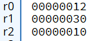
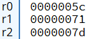
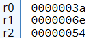
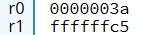

## Logische Instrukionen
### Die Logische Verundung mit AND
Der `AND`-Operator in ARMv7 führt eine bitweise logische UND-Operation zwischen zwei Werten durch. Dabei wird jedes Bit des ersten Operanden (in der Wahrheitstabelle A) mit dem entsprechenden Bit des zweiten Operanden (in der Wahrheitstabelle B) verglichen. Das Ergebnis ist nur dann 1, wenn beide Bits 1 sind. Andernfalls ist das Ergebnis 0.

#### Wahrheitstabelle für AND
|  A  |  B  |  Y  |
|-----|-----|-----|
|  0  |  0  |  0  |
|  0  |  1  |  0  |
|  1  |  0  |  0  |
|  1  |  1  |  1  |

#### Syntax
**AND (immediate):**
```
AND <Zielregister>, <RegisterA>, #imm
```
In dieser Variante wird der Wert, der in `Register A` gespeichert ist, mit einem unmittelbaren Wert (`#imm`) bitweise verundet. Das Ergebnis wird im `Zielregister` gespeichert.

**AND (register):**
```
AND <Zielregister>, <RegisterA>, <RegisterB>
```
Hier wird der Wert, der in `Register A` gespeichert ist, mit dem Wert in `Register B` bitweise verundet. Das Ergebnis wird in das `Zielregister` gespeichert.

#### Beispiel
```
.global _start
_start:
    
    MOV R0, #0x12
    MOV R1, #0x30
    AND R2, R0, R1
```
In diesem Beispiel werden die Hexadezimalwerte `0x12` und `0x30` in die Register `R0` und `R1` geladen. Mit der AND-Operation werden die beiden Werte, die in den Registern R0 und R1 gespeichert sind, bitweise miteinander verundet. Das Ergebnis dieser Operation wird dann in `R2` gespeichert.

**So sehen die Register in CPULator nach der Ausführung aus:**

 

**Darstellung der Bitweisen Verundung:**

Um das Ergebnis der bitweisen Verundung zu verdeutlichen, werden die Hexadezimalwerte `0x12` und `0x30` in ihre Binärform umgewandelt und die Operation durchgeführt:

```
0001 0010 (0x12)
0011 0000 (0x30)
----------------
0001 0000 (0x10)
```

Wie es hier ersichtlich ist, ergibt sich als Ergebnis der Verundung `0x10`. Dies liegt daran, dass nur die Bits, die in beiden Operanden an der gleichen Position 1 sind, im Ergebnis auf 1 gesetzt werden. Alle anderen Bits sind 0. (Vergleich: Wahrheitstabelle)

### Die Logische Verundung mit ORR
Der ORR-Operator führt eine bitweise logische ODER-Operation zwischen zwei Werten durch. Dabei wird jedes Bit des ersten Operanden (in der Wahrheitstabelle A) mit dem entsprechenden Bit des zweiten Operanden (in der Wahrheitstabelle B) verglichen. Das Ergebnis ist dann 1, wenn mindestens eines der beiden Bits 1 ist. Nur wenn beide Bits 0 sind, ist das Ergebnis 0.

#### Wahrheitstabelle für ORR
|  A  |  B  |  Y  |
|-----|-----|-----|
|  0  |  0  |  0  |
|  0  |  1  |  1  |
|  1  |  0  |  1  |
|  1  |  1  |  1  |

#### Syntax

**ORR (immediate):**
```
ORR <Zielregister>, <RegisterA>, #imm
```
In dieser Variante wird der Wert, der in `Register A` gespeichert ist, mit einem unmittelbaren Wert (`#imm`) bitweise verodert. Das Ergebnis wird im `Zielregister` gespeichert.

**ORR (register):**
```
ORR <Zielregister>, <RegisterA>, <RegisterB>
```
Hier wird der Wert, der in `Register A` gespeichert ist, mit dem Wert in `Register B` bitweise verodert. Das Ergebnis wird in das `Zielregister` gespeichert.

#### Beispiel
```
.global _start
_start:
    
    MOV R0, #0x5c
    MOV R1, #0x71
    ORR R2, R0, R1
```
In diesem Beispiel werden die Hexadezimalwerte `0x5c` und `0x71` in die Register `R0` und `R1` geladen. Mit der ORR-Operation werden die beiden Werte, die in den Registern R0 und R1 gespeichert sind, bitweise miteinander verodert. Das Ergebnis dieser Operation wird dann in `R2` gespeichert.

**So sehen die Register in CPULator nach der Ausführung aus:**

 

**Darstellung der Bitweisen Veroderung:**

Um das Ergebnis der bitweisen Veroderung zu verdeutlichen, werden die Hexadezimalwerte `0x5c` und `0x71` in ihre Binärform umgewandelt und die Operation durchgeführt:

```
0101 1100 (0x5c)
0111 0001 (0x71)
----------------
0111 1101 (0x7d)
```

Wie es hier ersichtlich ist, ergibt sich als Ergebnis der Veroderung `0x7d`. Dies liegt daran, dass das Ergebnis 1 ist, wenn mindestens eines der beiden Bits 1 ist. Alle anderen Bits werden entsprechend der ODER-Operation gesetzt. (Vergleich: Wahrheitstabelle)

### Die Logische Exklusive Veroderung mit EOR
Der EOR-Operator (Exclusive OR) in ARMv7 führt eine bitweise exklusive ODER-Operation zwischen zwei Werten durch. Dabei wird jedes Bit des ersten Operanden (in der Wahrheitstabelle A) mit dem entsprechenden Bit des zweiten Operanden (in der Wahrheitstabelle B) verglichen. Das Ergebnis ist dann 1, wenn die Bits unterschiedlich sind, also eines der Bits 1 und das andere 0 ist. Sind beide Bits gleich, ist das Ergebnis 0.

#### Wahrheitstabelle für EOR
|  A  |  B  |  Y  |
|-----|-----|-----|
|  0  |  0  |  0  |
|  0  |  1  |  1  |
|  1  |  0  |  1  |
|  1  |  1  |  0  |

#### Syntax

**EOR (immediate):**
```
EOR <Zielregister>, <RegisterA>, #imm
```
In dieser Variante wird der Wert, der in `Register A` gespeichert ist, mit einem unmittelbaren Wert (`#imm`) bitweise exklusiv verodert. Das Ergebnis wird im `Zielregister` gespeichert.

**EOR (register):**
```
ORR <Zielregister>, <RegisterA>, <RegisterB>
```
Hier wird der Wert, der in `Register A` gespeichert ist, mit dem Wert in `Register B` bitweise exklusiv verodert. Das Ergebnis wird in das `Zielregister` gespeichert.

#### Beispiel
```
.global _start
_start:

    MOV R0, #0x3a
    MOV R1, #0x6e
    EOR R2, R0, R1
```
In diesem Beispiel werden die Hexadezimalwerte `0x3a` und `0x6e` in die Register `R0` und `R1` geladen. Mit der EOR-Operation werden die beiden Werte, die in den Registern R0 und R1 gespeichert sind, bitweise miteinander exklusiv verodert. Das Ergebnis dieser Operation wird dann in `R2` gespeichert.

**So sehen die Register in CPULator nach der Ausführung aus:**

 

**Darstellung der Bitweisen exklusiven Veroderung:**

Um das Ergebnis der bitweisen exklusiven Veroderung zu verdeutlichen, werden die Hexadezimalwerte `0x3a` und `0x6d` in ihre Binärform umgewandelt und die Operation durchgeführt:

```
0011 1010 (0x3a)
0110 1110 (0x6e)
----------------
0101 0100 (0x54)
```

Wie es hier ersichtlich ist, ergibt sich als Ergebnis der exklusive Veroderung `0x6e`.  Dies liegt daran, dass das Ergebnis 1 ist, wenn die Bits unterschiedlich sind (eines 1, das andere 0). Sind beide Bits gleich, ist das Ergebnis 0. (Vergleich: Wahrheitstabelle)


### Die Logische Negation mit MVN
Der MVN-Operator (Move Not) in ARMv7 führt eine bitweise Negation (NOT-Operation) auf einen Wert durch. Dabei wird jedes Bit des Operanden invertiert, d.h. eine 1 wird zu 0 und 0 wird zu 1. Das Ergebnis wird dann in das Zielregister geschrieben.

#### Wahrheitstabelle für MVN
|  A  |  Y  |
|-----|-----|
|  0  |  1  |
|  1  |  0  |

#### Syntax

**MVN (immediate):**
```
MVN <Zielregister>, #imm
```
In dieser Variante wird ein unmittelbarer Wert (`#imm`) bitweise negiert. Das Ergebnis wird im `Zielregister` gespeichert.

**MVN (register):**
```
MVN <Zielregister>, <RegisterA>
```
Hier wird der Wert, der in `Register A` gespeichert ist, bitweise negiert. Das Ergebnis wird in das `Zielregister` geschrieben.

#### Beispiel
```
.global _start
_start:

    MOV R0, #0x3a
    MVN R1, R0
```
In diesem Beispiel wird der Hexadezimalwert `0x3a` in das Register `R0` geladen. Mit der MVN-Operation wird dieser Wert bitweise negiert. Das Ergebnis dieser Operation wird dann in `R1` gespeichert.

**So sehen die Register in CPULator nach der Ausführung aus:**

 

**Darstellung der Bitweisen Negierung:**

Um das Ergebnis der bitweisen Negierung zu verdeutlichen, wird der Hexadezimalwert `0x3a` in ihre Binärform umgewandelt und die Operation durchgeführt. Es ist wichtig zu beachten, dass alle 32 Bits negiert werden::

```
0000 0000 0000 0000 0000 0000 0011 1010 (0x3a)
-----------------------------------------------
1111 1111 1111 1111 1111 1111 1100 0101 (0xffffffc5)
```

Wie hier ersichtlich ist, ergibt sich als Ergebnis der Negation `0xffffffc5`. Dies liegt daran, dass alle Bits des ursprünglichen Wertes invertiert wurden: `1` wird zu `0`, und `0` wird zu `1`. (Vergleich: Wahrheitstabelle)

|----------------------------|--------------------------------------|------------------------------|
|   [zurück](arithinstr.md)  |    [Hauptmenü](../ueberblick.md)     |   [weiter](shiftinstr.md)    |
