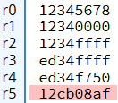

# A.2 Basic Blocks implementieren
## 2.3.3 Datenverarbeitung: Logische Instruktionen
### Lösung der Übungaufgabe zu logischen Instruktionen

### Lösungsansatz:
1. Extrahieren der oberen 16 Bits: Überlegen Sie, wie die Bitmaskierung funktioniert. Um nur die oberen 16 Bits zu extrahieren, kann eine logische UND-Operation (AND) mit einer Maske verwendet werden, die nur die oberen Bits erlaubt. 

2. Setzen der unteren 16 Bits auf 0xFFFF: Hier ist es wichtig, die oberen 16 Bits unverändert zu lassen. Nutze die ORR-Operation, um die unteren Bits auf 0xFFFF zu setzen.

3. Invertieren der oberen 8 Bits: Denken Sie an die Eigenschaften der Exklusiv-Veroderung (EOR). Um die oberen 8 Bits zu invertieren, erstelle eine Maske, die nur die oberen 8 Bits auf 1 hat. Verwende dann EOR, um die Bits gezielt zu ändern, während die restlichen Bits erhalten bleiben.

4. Erstellen der 16-Bit-Bitmaske für 0xF750: Um die unteren 16 Bits auf 0xF750 zu setzen, finde heraus, welche Bits aktuell in den unteren 16 Bits vorhanden sind und welche du mit EOR ändern möchtest. Überlege, wie die Exklusiv-Veroderung die gewünschten Bits beeinflusst. Es könnte hilfreich sein, die Bitmuster für 0xF750 und die aktuellen unteren 16 Bits zu vergleichen. Stellen Sie bestenfalls hierfür die die Hexzahlen als Binärziffern dar. 

5. Invertieren des Endergebnisses: Es gibt mehrere Möglichkeiten, alle Bits zu invertieren. Suchen Sie sich bestenfalls die einfachste heraus.

### Lösung: 
```
LDR R0, =0x12345678		@ Lade die 32-Bit-Zahl 0x12345678 in das Register R0

@ Schritt 1: Extrahiere die oberen 16 Bits (0x1234) in R1
LDR R1, =0xFFFF0000		
AND R1, R0, R1			@ Führe eine AND-Operation mit R0 und R1 aus, um die oberen 16 Bits zu extrahieren

@ Schritt 2: Setze die unteren 16 Bits auf 0xFFFF
LDR R2, =0x0000FFFF		   
ORR R2, R1, R2			@ Führe eine ORR-Operation durch, um die unteren 16 Bits auf 0xFFFF zu setzen

@ Schritt 3: Invertiere die oberen 8 Bits
LDR R3, =0xFF000000   
EOR R3, R2, R3			@ Führe eine EOR-Operation mit R3 durch, um die oberen 8 Bits in R2 zu invertieren

@ Schritt 4: Setze die unteren 16 Bits auf 0xF750
LDR R4, =0x000008AF		@ Lade die Maske 0x000008AF in R4, um die Exklusiv-Veroderung mit den unteren 16 Bits vorzunehmen
EOR R4, R3, R4			@ Führe eine EOR-Operation aus, um die unteren 16 Bits auf 0xF750 zu setzen

@ Schritt 5: Invertiere das Ergebnis
MVN R5, R4	
```

**Erklärung zu Schritt 4:**
Um die Unteren 16-Bits mit EOR auf 0xF750 zu bringen, muss man schauen, welche Bits des initialen Werts invertiert werden müssen. Das heißt, man muss schauen, wo man mit 1 exklusiv verodern muss, um zu invertieren.

So sieht es dann in Binärer schreibweise aus:
```
    1110 1101 0011 0100 1111 1111 1111 1111     @ Der Wert nach Schritt 3 (0xed34ffff) in binärer Darstellung
^   0000 0000 0000 0000 0000 1000 1010 1111     @ Mit 1 die gewünschten Bits invertieren, mit 0 gleichbehalten
--------------------------------------------
    1110 1101 0011 0100 1111 0111 0101 0000     @ Der Wert, der nach Schritt 4 rauskommen soll (0xed34f750)
```

**So sollen die Register nach Ausführung aussehen:**


    
|-------------------------------|------------------------------------|----------------------------|
|   [zurück](logue.md)          |   [Hauptmenü](../ueberblick.md)    |   [weiter](shiftinstr.md)  |


| **2.3 Datenverarbeitung**                                             |
|-----------------------------------------------------------------------|
| [2.3.1 Die ALU](arithlogintro.md)                                     |
| [2.3.2 Arithmetische Instruktionen](arithinstr.md)                    |
| [2.3.3 Logische Instrukionen](loginstr.md)                            |
| [2.3.4 Shift Operationen](shiftinstr.md)                              |
| [2.3.5 Das Statusregister](flags.md)                                  |
| [2.3.6 Vergleichsoperatoren](comp.md)                                 |
| [2.3.7 Bedingungscodes](beding.md)                                    |
| [2.3.8 Bedingte Instruktionsausführung](bedinstr.md)                  |
