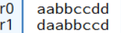

# A.2 Basic Blocks implementieren
## 2.3.4 Datenverarbeitung: Shift Operationen

Shift-Operationen sind grundlegende Befehle in der ARMv7-Architektur, die dazu verwendet werden, die Bits eines Registers nach links oder rechts zu verschieben. Es gibt verschiedene Arten von Shift-Operationen, die jeweils unterschiedliche Auswirkungen auf die Bits haben und je nach Bedarf des Programms eingesetzt werden können. Im Folgenden werden wir die wichtigsten Shift-Operationen in ARMv7 genauer betrachten.

### Logisches Shiften nach Links (LSL)
Das logische Shiften nach links (LSL, "Logical Shift Left") ist eine Operation, bei der die Bits in einem Register um eine bestimmte Anzahl von Stellen nach links verschoben werden. Die leeren Stellen auf der rechten Seite werden dabei mit Nullen aufgefüllt. Diese Operation wird häufig verwendet, um eine schnelle Multiplikation einer Zahl mit einer Potenz von 2 zu erreichen.

#### Syntax
**LSL (immediate)**
```
LSL <Zielregister>, <RegisterA>, #imm
```
Hier wird der Wert in `Register A` um `#imm` Stellen nach links verschoben. Das Ergebnis wird anschließend in das `Zielregister` gespeichert.

**LSL (register)**
```
LSL <Zielregister>, <RegisterA>, <RegisterB>
```
Hier wird der Wert in `Register A` um den Wert, der in `Register B` steht, nach links verschoben. Das Ergebnis wird anschließend in das `Zielregister` gespeichert.

#### Beispiel
```	
MOV R0, #10
MOV R1, #4
LSL R2, R0, #3
LSL R3, R0, R1
```
Zuerst werden die Dezimalwerte `10` und `4` in die Register `R0` und `R1` geladen. Mit dem ersten LSL-Befehl wird der Wert in `R0` um den unmittelbaren Wert `3` nach links verschoben und das Ergebnis in `R2` gespeichert. Mit dem zweiten LSL-Befehl wird der Wert in `R0` um die Anzahl der Stellen nach links verschoben, die im Register `R1` gespeichert sind (also 4). Dieses Ergebnis wird anschließend in `R3` gespeichert.

**So sehen die Register (in Dezimaldarstellung) in CPULator nach der Ausführung aus:**

 

Wie man an den Ergebnissen erkennen kann, führt das Linksschieben des Wertes `10`, der in Register `R0` gespeichert ist, zu einer Multiplikation mit Potenzen von `2`. Im ersten Fall, bei einer Verschiebung um `3` Stellen, wird der Wert mit `2^3` multipliziert. Das entspricht der Rechnung `10 * 8`, was zu dem Ergebnis `80` führt. Im zweiten Fall, bei einer Verschiebung um `4` Stellen, entspricht die Operation einer Multiplikation mit `2^4`. Das entspricht der Rechnung `10 * 16`, was zu dem Ergebnis `160` führt. Diese Ergebnisse werden entsprechend in den Registern `R2` und `R3` gespeichert.

**Darstellung der Bitweisen logischen Verschiebung nach links um den unmittelbaren Wert 3:**

```
0000 0000 0000 0000 0000 0000 0000 1010 (0xa bzw. 10)
-----------------------------------------------
0000 0000 0000 0000 0000 0000 0101 0000 (0x50 bzw. 80)
```
Beim Logischen Links Shiften des Dezimalwertes `10` um 3 Stellen werden die Bits nach links geschoben, anschließend werden die freien Positionen auf der rechten Seite automatisch mit Nullen aufgefüllt. Da Register in ARMv7 immer 32 Bit groß sind, werden bei der Verschiebung die obersten 3 Bits (in diesem Beispiel waren es nur Nullen), die über die 32-Bit-Grenze hinausgehen, abgeschnitten und gehen verloren. So bleibt der neue Wert `80` innerhalb der 32-Bit-Grenze und das Ergebnis wird korrekt im Zielregister gespeichert.

### Logischen Shiften nach Rechts
Das logische Shiften nach rechts (LSR, "Logical Shift Right") ist eine Operation, bei der die Bits in einem Register um eine bestimmte Anzahl von Stellen nach rechts verschoben werden. Die leeren Stellen auf der linken Seite werden dabei mit Nullen aufgefüllt. Diese Operation wird häufig verwendet, um eine Zahl durch eine Potenz von 2 zu teilen.

#### Syntax
**LSR (immediate)**
```
LSR <Zielregister>, <RegisterA>, #imm
```
Hier wird der Wert in `Register A` um `#imm` Stellen nach rechts verschoben. Das Ergebnis wird anschließend in das `Zielregister` gespeichert.

**LSR (register)**
```
LSR <Zielregister>, <RegisterA>, <RegisterB>
```
Hier wird der Wert in `Register A` um den Wert, der in `Register B` steht, nach rechts verschoben. Das Ergebnis wird anschließend in das `Zielregister` gespeichert.

#### Beispiel
```
MOV R0, #1024
MOV R1, #4
LSR R2, R0, R1
```

Zuerst werden die Dezimalwerte `1024` und `4` in die Register `R0` und `R1` geladen. Mit dem LSR-Befehl wird der Wert in `R0` um die Anzahl der Stellen nach rechts verschoben, die im Register `R1` gespeichert sind (also 4). Dieses Ergebnis wird anschließend in `R2` gespeichert.

**So sehen die Register (in Dezimaldarstellung) in CPULator nach der Ausführung aus:**

 

Wie man an den Ergebnissen erkennen kann, führt das Rechtsschieben des Wertes `1024`, der in Register `R0` gespeichert ist, zu einer Division durch Potenzen von 2. Im Beispiel wird der Wert um 4 Stellen nach rechts verschoben. Dies entspricht einer Division durch `2^4` (2^4 = 16). Die Rechnung lautet daher `1024 / 16`, was zu dem Ergebnis `64` führt. Dieses Ergebnis wird im Register `R2` gespeichert.

**Darstellung der Bitweisen logischen Verschiebung nach rechts um 4 Stellen:**

```
0000 0000 0000 0000 0000 0100 0000 0000 (0x400 bzw. 1024)
-----------------------------------------------
0000 0000 0000 0000 0000 0000 0100 0000 (0x40 bzw. 64)
```

Beim logischen Rechtsschieben des Dezimalwertes `1024` um `4` Stellen werden die Bits nach rechts verschoben, und die freien Positionen auf der linken Seite werden automatisch mit Nullen aufgefüllt. Da Register in ARMv7 immer 32 Bit groß sind, werden die 4 Bits, die durch die Verschiebung über die rechte Grenze hinausgehen, abgeschnitten und gehen verloren. So bleibt der neue Wert `64` innerhalb der 32-Bit-Grenze und das Ergebnis wird korrekt im Zielregister gespeichert.

### Arithmetisches Shiften nach Rechts
Das arithmetische Shiften nach rechts (ASR, "Arithmetic Shift Right") ähnelt dem logischen Shiften nach rechts, jedoch mit einem wichtigen Unterschied: Beim ASR wird das höchstwertige Bit (das Vorzeichenbit bei signed Zahlen) bei der Verschiebung beibehalten und die freien Stellen auf der linken Seite werden mit dem Vorzeichenbit aufgefüllt. Diese Operation wird oft verwendet, um eine signierte Zahl durch eine Potenz von 2 zu teilen, während das Vorzeichen erhalten bleibt.

#### Syntax
**ASR (immediate)**
```
ASR <Zielregister>, <RegisterA>, #imm
```
Hier wird der Wert in `Register A` um `#imm` Stellen nach rechts arithmetisch verschoben, wobei das Vorzeichenbit auch berücksichtigt wird. Das Ergebnis wird anschließend in das `Zielregister` gespeichert.

**ASR (register)**
```
ASR <Zielregister>, <RegisterA>, <RegisterB>
```
Hier wird der Wert in `Register A` um die Anzahl der Stellen nach rechts arithmetisch verschoben, die im `Register B` gespeichert sind. Auch hier wird das Vorzeichenbit berücksichtigt. Das Ergebnis wird anschließend in das `Zielregister` gespeichert. 


#### Beispiel
```	
MOV R0, #-80
MOV R1, #2
ASR R2, R0, R1
```

Zuerst werden die signed Dezimalwerte `-80` und `2` in die Register `R0` und `R1` geladen. Mit dem ASR-Befehl wird der Wert in `R0` um die Anzahl der Stellen nach rechts verschoben, die im Register `R1` gespeichert sind (also `2`), wobei das Vorzeichenbit berücksichtigt wird. Dieses Ergebnis wird anschließend in `R2` gespeichert.

**So sehen die Register (in signed Dezimaldarstellung) in CPULator nach der Ausführung aus:**

 

Wie man an den Ergebnissen erkennen kann, führt das arithmetische Rechtsschieben des negativen Wertes `-80`, der in Register `R0` gespeichert ist, zu einer Division durch Potenzen von `2`, wobei das Vorzeichen erhalten bleibt. Im Beispiel wird der Wert um `2` Stellen nach rechts verschoben. Dies entspricht einer Division durch `2^2` (also 4). Die Rechnung lautet daher `-80 / 4`, was zu dem Ergebnis `-20` führt. Dieses Ergebnis wird im Register `R2` gespeichert.

**Darstellung der Bitweisen arithmetischen Verschiebung nach rechts um 2 Stellen:**

```
1111 1111 1111 1111 1111 1111 1011 0000 (0xffffffb0 bzw. -80)
------------------------------------------------------
1111 1111 1111 1111 1111 1111 1110 1100 (0xffffffec bzw. -20)
```

Beim arithmetischen Rechtsschieben des Dezimalwertes `-1024` um `4` Stellen werden die Bits nach rechts verschoben, wobei die freien Positionen auf der linken Seite mit dem Vorzeichenbit (also Einsen bei einer negativen Zahl) aufgefüllt werden. Die 4 Bits, die durch die Verschiebung über die rechte Grenze hinausgehen, werden abgeschnitten und gehen verloren. Das Vorzeichen bleibt erhalten, und das Ergebnis `-64` wird korrekt im Zielregister gespeichert.


### Rotieren nach Rechts (ROR)

Das Rotieren nach rechts (ROR, "Rotate Right") ist eine Operation, bei der die Bits in einem Register um eine bestimmte Anzahl von Stellen nach rechts verschoben werden. Im Gegensatz zum logischen Shiften, bei dem die leeren Stellen mit Nullen aufgefüllt werden, werden beim Rotieren die Bits, die über die rechte Grenze hinausgeschoben werden, auf der linken Seite wieder eingefügt. Dadurch bleiben alle Bits erhalten und rotieren zyklisch innerhalb des Registers.

#### Syntax

**ROR (immediate)**

```
ROR <Zielregister>, <RegisterA>, #imm
```
Hier wird der Wert in `Register A` um `#imm` Stellen nach rechts rotiert. Das Ergebnis wird anschließend in das `Zielregister` gespeichert.

**ROR (register)**
```
ROR <Zielregister>, <RegisterA>, <RegisterB>
```
Hier wird der Wert in `Register A` um die Anzahl der Stellen nach rechts rotiert, die im `Register B` gespeichert sind. Das Ergebnis wird anschließend in das `Zielregister` gespeichert. 


#### Beispiel
```
LDR R0, =0xaabbccdd
ROR R1, R0, #4
```

Zuerst wird die Hexadezimalzahl `0xaabbccdd` in das Register `R0` geladen. Mit dem `ROR`-Befehl wird der Wert in `R0` um den unmittelbaren Wert `4` Stellen nach rechts rotiert. Dabei werden die Bits, die über die rechte Grenze hinausgehen, am linken Ende wieder eingefügt. Das Ergebnis dieser Rotation wird anschließend in `R1` gespeichert. 

**So sehen die Register (in Hexadezimaldarstellung) in CPULator nach der Ausführung aus:**

 

**Darstellung der Bitweisen Rotation nach rechts um 4 Stellen:**

```
1010 1010 1011 1011 1100 1100 1101 1101 (0xaabbccdd)
------------------------------------------------------
1101 1010 1010 1011 1011 1100 1100 1101 (0xdaabbccd)
```
Wie man an den Ergebnissen erkennen kann, führt das Rotieren der Zahl `0xaabbccdd` nach rechts um `4` Stellen dazu, dass die unteren 4 Bits `1101` (bzw. `0xd`) nach links verschoben und am Anfang der Zahl wieder eingefügt werden. Das Ergebnis dieser Rotation `0xdaabbccd` wird zuletzt im Register `R1` gespeichert. 

|--------------------------|--------------------------------------|---------------------------|
|   [zurück](loguelsg.md)  |    [Hauptmenü](../ueberblick.md)     |   [weiter](shiftue.md)    |


| **2.3 Datenverarbeitung**                                             |
|-----------------------------------------------------------------------|
| [2.3.1 Die ALU](arithlogintro.md)                                     |
| [2.3.2 Arithmetische Instruktionen](arithinstr.md)                    |
| [2.3.3 Logische Instrukionen](loginstr.md)                            |
| [2.3.4 Shift Operationen](shiftinstr.md)                              |
| [2.3.5 Das Statusregister](flags.md)                                  |
| [2.3.6 Vergleichsoperatoren](comp.md)                                 |
| [2.3.7 Bedingungscodes](beding.md)                                    |
| [2.3.8 Bedingte Instruktionsausführung](bedinstr.md)                  |