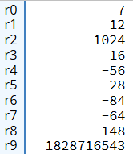
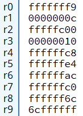

# A.2 Basic Blocks implementieren
## 2.3.4 Datenverarbeitung: Shift Operationen
### Lösung der Übungsaufgabe
#### Lösungsansatz:

1. **Multiplikation:** Multiplizieren Sie a * b mithilfe der LSL-Instruktion (linke Verschiebung), indem Sie b in seine Potenzen von 2 zerlegen (b = 12 = 8 + 4 = 2³ + 2²).

2. **Division:** Teilen Sie c durch d, indem Sie die ASR-Instruktion (arithmetische rechte Verschiebung) verwenden. Die LSR-Instruktion eignet sich da nicht, da das Vorzeichen bei signed Zahlen dann nicht berücksichtigt wird. Das Teilen von c durch 16 lässt sich durch eine ASR-Operation mit einer Verschiebung um 4 Stellen realisieren (weil 2⁴ = 16).

3. **Addition:** Addieren Sie das Ergebnis der Multiplikation und der Division mit ADD auf.

4. **Rotation:** Rotieren Sie das finale Ergebnis um 8 Stellen nach rechts mit ROR. Dieser verschiebt die Bits nach rechts und fügt die Bits, die hinausfallen, am linken Rand wieder ein.

#### Lösung:
```
LDR R0, =-7           @ Lade a = -7 in R0
LDR R1, =12           @ Lade b = 12 in R1
LDR R2, =-1024        @ Lade c = -1024 in R2 
LDR R3, =16           @ Lade d = 16 in R3

@ Multipliziere a * b durch Shiften (Multiplikation)
LSL R4, R0, #3        @ R4 = (-7) * 8 = -56
LSL R5, R0, #2        @ R5 = (-7) * 4 = -28
ADD R6, R4, R5        @ R6 = (-56) + (-28) = -84

@ Teile c durch d durch arithmetische Rechtsverschiebung (signed Division)
ASR R7, R2, #4        @ R7 = -1024 / 16 = -64

@ Addiere die Ergebnisse der Multiplikation und Division
ADD R8, R6, R7        @ R8 = -84 + (-64) = -148

@ Rotiere das Endergebnis um 8 Stellen (= ein Byte) nach rechts
ROR R9, R8, #8       
```

#### So sollten die Register nach der Ausführung aussehen:

***Ergebnisse in Signed-Decimal-Darstellung:***

 

***Ergebnisse in Hexadezimaldarstellung:***

 

|-------------------------------|------------------------------------|----------------------------|
|   [zurück](shiftue.md)        |   [Hauptmenü](../ueberblick.md)    |   [weiter](flags.md)       |


| **2.3 Datenverarbeitung**                                             |
|-----------------------------------------------------------------------|
| [2.3.1 Die ALU](arithlogintro.md)                                     |
| [2.3.2 Arithmetische Instruktionen](arithinstr.md)                    |
| [2.3.3 Logische Instrukionen](loginstr.md)                            |
| [2.3.4 Shift Operationen](shiftinstr.md)                              |
| [2.3.5 Das Statusregister](flags.md)                                  |
| [2.3.6 Vergleichsoperatoren](comp.md)                                 |
| [2.3.7 Bedingungscodes](beding.md)                                    |
| [2.3.8 Bedingte Instruktionsausführung](bedinstr.md)                  |
