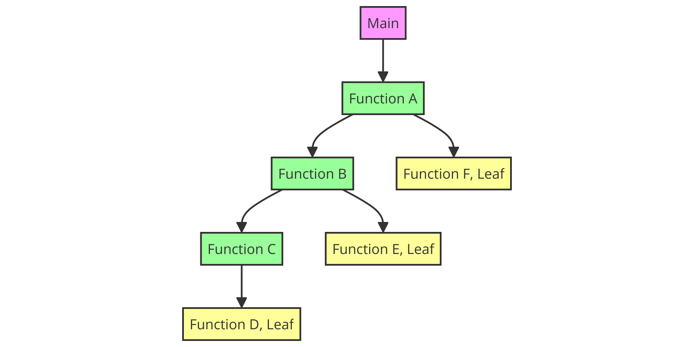

# A.5 Prozedurale Programmierung
## 5.2.4 Was ist eine Prozedur: Was ist der Calltree?

Der Calltree (auch Aufrufbaum genannt) ist eine hierarchische Darstellung, die zeigt, wie Prozeduren oder Funktionen in einem Programm aufgerufen werden. Er visualisiert die Beziehungen und die Reihenfolge, in der Prozeduren aufgerufen werden, und stellt eine Art "Baumstruktur" dar, in der jede Knotenstelle eine Prozedur repräsentiert.

## Aufbau des Calltrees
Im Calltree wird jede Prozedur als Knoten dargestellt. Wenn eine Prozedur eine andere Prozedur aufruft, wird dies durch eine Verbindung (Kante) zwischen den Knoten dargestellt. Die Wurzel des Baums ist die Hauptprozedur oder der Einstiegspunkt des Programms, von dem aus alle anderen Prozeduren aufgerufen werden. Die Äste des Baums zeigen die Hierarchie der Aufrufe an.

## Leaf- und Nonleaf-Prozeduren
Als **Leaf-Prozeduren** (Blattprozeduren) bezeichnet man die Knoten im Calltree, die keine weiteren Prozeduren aufrufen. Das bedeutet, sie sind am Ende eines Aufrufzweigs und führen keine weiteren Unterprozeduren aus. Leaf-Prozeduren sind also kurz gesagt diejenigen Prozeduren, die keine weiteren Aufrufe tätigen.

**Nonleaf-Prozeduren** (Nicht-Blattprozeduren) sind dagegen Knoten im Calltree, die selbst andere Prozeduren aufrufen. Diese Prozeduren sind nicht am Ende eines Aufrufzweigs, sondern dienen als Verzweigungspunkte, von denen weitere Prozeduren aufgerufen werden. Sie haben also Kinder im Baum, die ihre eigenen Aufrufe enthalten können.

|----------------------------------|------------------------------------|-------------------------------|
|   [zurück](wasiststackframe.md)  |   [Hauptmenü](../ueberblick.md)    |   [weiter](prozlrstack.md)    |

| **5.2 Was Was ist eine Prozedur**                                             |
|-------------------------------------------------------------------------------|
| [5.2.1 Intro](wasistproz.md)                                                  |
| [5.2.2 Der Stack](wasiststack.md)                                             |
| [5.2.3 Was ist der Stackframe einer Prozedur?](wasiststackframe.md)           |
| [5.2.4 Was ist der Calltree?](wasistcalltree.md)                              |
| [5.2.5 Prozeduren, Link Register und Stack](prozlrstack.md)                   |
| [5.2.6 Parameterübergabe und Rückgabewerte](param.md)                         |
| [5.2.7 Finde das geheime Passwort!](disasm_ue.md)                             |