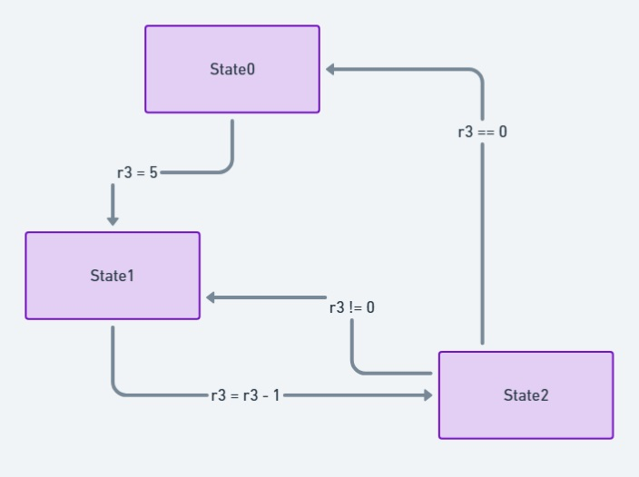

# A.3 Verknüpfungen von Basic Blocks
## 3.2.8 Kontrollstrukturen: Zustandsautomaten

**Zustandsautomaten** (State Machines) sind in der Programmierung ein wertvolles Werkzeug, um Abläufe strukturiert und übersichtlich darzustellen. Sie bestehen aus einer begrenzten Anzahl von **Zuständen**, die durch **Übergänge** verbunden sind. Ein Zustand repräsentiert einen bestimmten Moment im System, in dem bestimmte Aktionen oder Bedingungen gelten. Ein Übergang beschreibt den Wechsel zwischen Zuständen, der auf spezifischen Eingaben oder Bedingungen basiert.

Durch die klare Struktur von Zustandsautomaten können Entwickler Abläufe und Entscheidungslogiken effizient abbilden. Sie finden breite Anwendung, etwa bei der Steuerung von Spieler- und Gegnerverhalten in Videospielen, in Kommunikationsprotokollen oder in der Automobilindustrie zur Motorsteuerung. In Benutzeroberflächen ermöglichen sie die Navigation durch Menüs und Dialoge.

Die Vorteile von Statemachines umfassen Modularität, die das Hinzufügen neuer Zustände vereinfacht, geringe Fehleranfälligkeit durch klar definierte Übergänge und die Wiederverwendbarkeit in verschiedenen Projekten. Zustandsautomaten verbessern zudem die Testbarkeit und Skalierbarkeit der Software, was sie ideal für einfache und komplexe Systeme macht.

|-----------------------------------------------------------------------------------------------------------------------------------------|
|[Weiterführende Informationen zu Zustandsautomaten](https://www.youtube.com/watch?v=58N2N7zJGrQ&list=PLBlnK6fEyqRgp46KUv4ZY69yXmpwKOIev) |

### Beispiel einer simplen Statemachine in Assembler
Ein einfaches Beispiel für einen Zustandsautomaten verdeutlicht die praktische Umsetzung. Das folgende Beispiel umfasst vier Zustände (`state0` bis `state2`) und zeigt sowohl unbedingte als auch bedingte Zustandsübergänge:

```asm
.section .data
    current_state: .word state0  
    
.section .text

_start:

statemachine:
    ldr r0, =current_state   @ Lade die Adresse der aktuellen Zustandsvariable
    mov lr, pc               @ Speichere die Rücksprungadresse im Link-Register
    ldr pc, [r0]             @ Lade den nächsten Zustand in den Program Counter
    b  statemachine          @ Endlosschleife

state0:
    @ Aktionen für state0
    adr r0, state1           @ Setze den nächsten Zustand auf state1
    mov r3, #5
    ldr r1, =current_state
    str r0, [r1]             @ Aktualisiere die Zustandsvariable
    bx lr                    @ Rückkehr zur Hauptschleife

state1:
    @ Aktionen für state1
    adr r0, state2           @ Setze den nächsten Zustand auf state2
    sub r3, r3, #1
    ldr r1, =current_state
    str r0, [r1]
    bx lr

state2:
    @ Aktionen für state2
    cmp r3, #0               @ Vergleiche Register r3 mit 0
    adreq r0, state0         @ Wenn gleich, setze nächsten Zustand auf state0
    adrne r0, state1         @ Wenn ungleich, setze nächsten Zustand auf state1
    ldr r1, =current_state
    str r0, [r1]
    bx lr
```

### Erläuterung des Beispiels


Wie im Diagramm zu sehen ist, implementiert das obige Beispiel einen endlosen Zustandsautomaten mit drei Zuständen:

1. **state0**: Initialisiert einen Zähler auf 5 und wechselt zu **state1**.
2. **state1**: Dekrementiert den Zähler um eins und wechselt zu **state2**.
3. **state2**: Prüft den Zähler:
   - Ist der Zähler null, wechselt zurück zu **state0**.
   - Andernfalls kehrt er zu **state1** zurück.

Dieser Zyklus wiederholt sich kontinuierlich, wobei der Automat bei **state0** startet, den Zähler herunterzählt und nach Erreichen von null erneut initialisiert wird.

**Erklärung der Implementierung:**

Zunächst wird die Zustandsvariable `current_state` in der Datensektion initialisiert und auf `state0` gesetzt. Die Hauptschleife der Zustandsmaschine lädt die Adresse der aktuellen Zustandsvariable, speichert die Rücksprungadresse im Link-Register (`lr`) und lädt den nächsten Zustand in den Program Counter (`pc`). Dadurch wird die entsprechende Zustandsroutine aufgerufen, die spezifische Aktionen ausführt und den nächsten Zustand bestimmt. Nach der Ausführung eines Zustands wird zur Hauptschleife zurückgesprungen, wodurch ein endloser Zyklus entsteht.

Jeder Zustand (`state0` bis `state2`) enthält Platzhalter für Aktionen und bestimmt den nächsten Zustand durch Adressierung und Aktualisierung der Zustandsvariable. 

|--------------------------------------------|------------------------------------|-----------------------------------------------|
|   [zurück](../ctrlstrukturen/do_while.md)  |   [Hauptmenü](../ueberblick.md)    |   [weiter](../Datentypen/datentypen.md)       |


| **3.2 Kontrollstrukturen**                                            |
|-----------------------------------------------------------------------|
| [3.2.1 Intro](../ctrlstrukturen/ctrlstrcts.md)                        |
| [3.2.2 If-not-then](../ctrlstrukturen/ifnotthen.md)                   |
| [3.2.3 If-elseIf-then](../ctrlstrukturen/ifelse.md)                   |
| [3.2.4 If-then elseif-then](../ctrlstrukturen/If-then_elseif-then.md) |
| [3.2.5 Switch-Case](../ctrlstrukturen/switchcase.md)                  |
| [3.2.6 While-Schleifen](../ctrlstrukturen/while.md)                   |
| [3.2.7 Do-While-Schleifen](../ctrlstrukturen/do_while.md)             |
| [3.2.8 Zustandsautomaten](../Statemachine/Statemach.md)               |