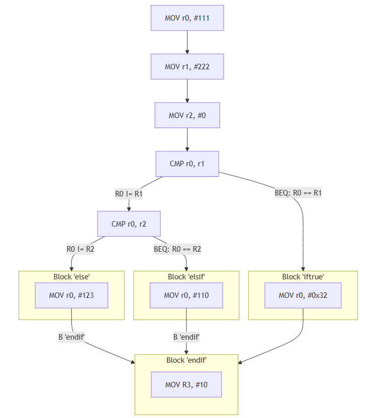
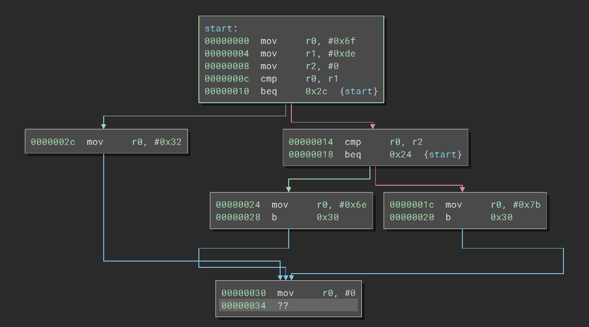

## If-then elseif-then
#### Pseudocode:
    ```
    if(Condition1) then... else if(Condition2) then... else
    ```

#### Beispiel in ARM-Assembler:
```asm
        MOV r0, #111
        MOV r1, #222
        MOV r2, #0
@ Kontrollstruktur if then... elsif... - else...
       
        CMP r0, r1  @ check(r0 == r1) - condition 1
        BEQ iftrue  
        CMP r0, r2  @ check(r0 == r2) - condition 2
        BEQ elsif

@ else...        
else:
        MOV r0, #123
        B endif
@ elsif...
elsif:
        MOV r0, #110
        B endif

@ if...
iftrue:
        MOV r0, #0x32

@ Ende Kontrollstruktur
endif:
        MOV r0, #00
```
#### Der Kontrollflussgraph zum Beispiel:



#### Betrachtet man den Controlflow-graph dieser Kontrollstruktur in einem Disassembler, ergibt sich folgendes Bild:



[weiter](switchcase.md)