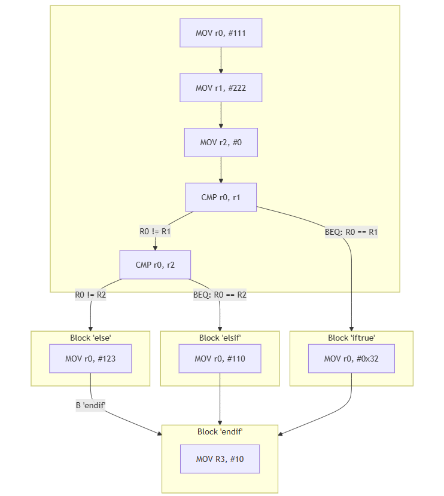

# A.3 Verknüpfungen von Basic Blocks
## 3.2.4 Kontrollstrukturen: If-then elseif-then

### Pseudocode:
    ```
    if(Condition1) then... else if(Condition2) then... else
    ```

### Beispiel in ARM-Assembler:
```asm
        MOV r0, #111
        MOV r1, #222
        MOV r2, #0

@ Kontrollstruktur if then... elsif... - else...     
        CMP r0, r1      @ check(r0 == r1) - condition 1
        BEQ iftrue  
        CMP r0, r2      @ check(r0 == r2) - condition 2
        BEQ elsif

@ else...        
else:
        MOV r0, #123
        B endif

@ elsif...
elsif:
        MOV r0, #110
        B endif

@ if...
iftrue:
        MOV r0, #0x32

@ Ende Kontrollstruktur
endif:
        MOV r0, #00
```
#### Der Kontrollflussgraph zum Beispiel:



#### Betrachtet man den Controlflow-graph dieser Kontrollstruktur in einem Disassembler, ergibt sich folgendes Bild:


|------------------------|------------------------------------|------------------------------|
|   [zurück](ifelse.md)  |   [Hauptmenü](../ueberblick.md)    |   [weiter](switchcase.md)    |


| **3.2 Kontrollstrukturen**                                            |
|-----------------------------------------------------------------------|
| [3.2.1 Intro](../ctrlstrukturen/ctrlstrcts.md)                        |
| [3.2.2 If-not-then](../ctrlstrukturen/ifnotthen.md)                   |
| [3.2.3 If-elseIf-then](../ctrlstrukturen/ifelse.md)                   |
| [3.2.4 If-then elseif-then](../ctrlstrukturen/If-then_elseif-then.md) |
| [3.2.5 Switch-Case](../ctrlstrukturen/switchcase.md)                  |
| [3.2.6 While-Schleifen](../ctrlstrukturen/while.md)                   |
| [3.2.7 Do-While-Schleifen](../ctrlstrukturen/do_while.md)             |
| [3.2.8 Zustandsautomaten](../Statemachine/Statemach.md)               |