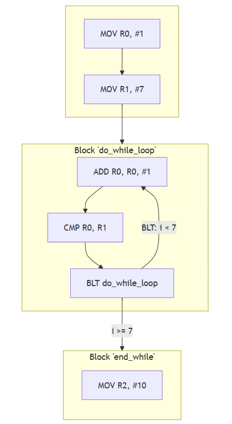

# A.3 Verknüpfungen von Basic Blocks
## 3.2.7 Kontrollstrukturen: Do-While-Schleifen

Die `do-while-Schleife` ist eine fußgesteuerte Schleife, bei der der Schleifeninhalt immer mindestens einmal ausgeführt wird, bevor die Bedingung am Ende geprüft wird. Das bedeutet, dass die Schleife den Block unabhängig von der Bedingung einmal durchläuft und erst danach entscheidet, ob sie erneut ausgeführt wird oder nicht.

### Fußgesteuerte Schleife 


### Pseudocode:
```
do: i = i + 1 ... while (i < limit)
```

### Beispiel in ARM-Assembler:
```	
    MOV R0, #1           @ i = 1
    MOV R1, #7           @ Setze die Obergrenze (7 für i < 7)

do_while_loop:
    ADD R0, R0, #1       @ i++
    CMP R0, R1           @ Vergleiche i mit der Obergrenze (R0-R1)
    BLT do_while_loop    @ Springe zurück, falls i < 7

end_while:
    MOV R2, #10          @ Programmende
```

Im Gegensatz zur normalen while-Schleife wird hier zuerst `i` um 1 erhöht und dann die Bedingung überprüft. Die Schleife läuft, bis `i >= 7` wird. Solange `i < 7` ist, wird zum Schleifenanfang `do_while_loop` zurückgesprungen.

### Der Kontrollflussgraph zum Beispiel



|-----------------------|------------------------------------|---------------------------------------------|
|   [zurück](while.md)  |   [Hauptmenü](../ueberblick.md)    |   [weiter](../Statemachine/Statemach.md)    |


| **3.2 Kontrollstrukturen**                                            |
|-----------------------------------------------------------------------|
| [3.2.1 Intro](../ctrlstrukturen/ctrlstrcts.md)                        |
| [3.2.2 If-not-then](../ctrlstrukturen/ifnotthen.md)                   |
| [3.2.3 If-elseIf-then](../ctrlstrukturen/ifelse.md)                   |
| [3.2.4 If-then elseif-then](../ctrlstrukturen/If-then_elseif-then.md) |
| [3.2.5 Switch-Case](../ctrlstrukturen/switchcase.md)                  |
| [3.2.6 While-Schleifen](../ctrlstrukturen/while.md)                   |
| [3.2.7 Do-While-Schleifen](../ctrlstrukturen/do_while.md)             |
| [3.2.8 Zustandsautomaten](../Statemachine/Statemach.md)               |