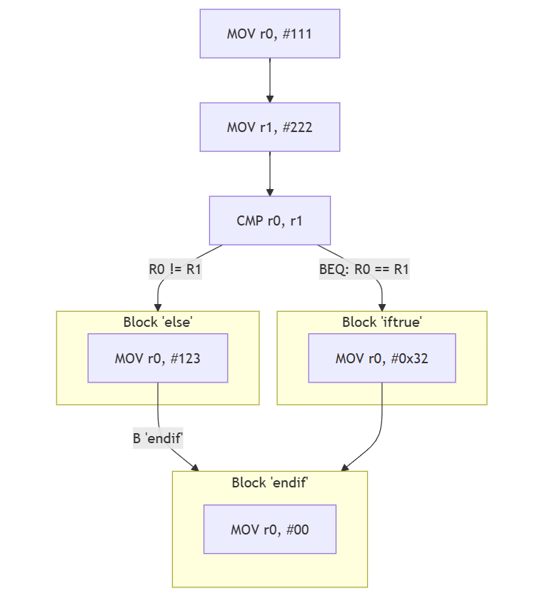
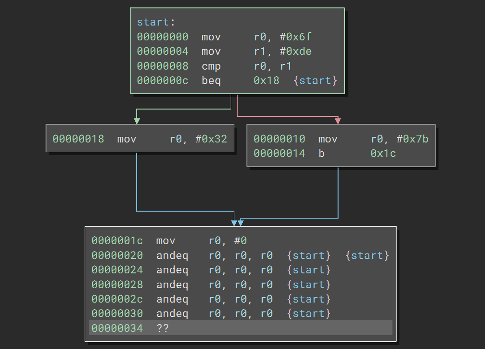

# 3. Verknüpfungen von Basic Blocks
## 3.2.3 Kontrollstrukturen: If-else

### Pseudocode:
```
if(Condition) then... else...
```
### Beispiel in ARM-Assembler:
```asm
        MOV r0, #111
        MOV r1, #222

        @ Kontrollstruktur if...then - else...
        CMP r0, r1  @ if(r0 == r1)
        BEQ iftrue
     
else:               @ Wenn Condition == false
        MOV r0, #123
        ...
        B endif
iftrue:              @ Wenn Condition = true
        MOV r0, #0x32
        ...
endif:               @ Ende der Kontrollstruktur
        MOV r0, #00
```
#### Der Kontrollflussgraph zum Beispiel:



#### Betrachtet man den Controlflow-graph dieser Kontrollstruktur in einem Disassembler, ergibt sich folgendes Bild:



|----------------------------|------------------------------------|---------------------------------------|
|   [zurück](ctrlstrcts.md)  |   [Hauptmenü](../ueberblick.md)    |   [weiter](If-then_elseif-then.md)    |

