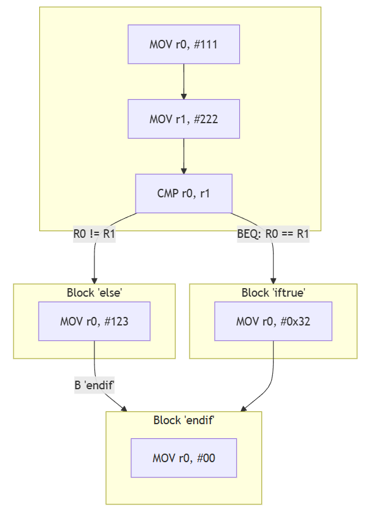

# A.3 Verknüpfungen von Basic Blocks
## 3.2.3 Kontrollstrukturen: If-else

### Pseudocode:
```
if(Condition) then... else...
```
### Beispiel in ARM-Assembler:
```asm
        MOV r0, #111
        MOV r1, #222

        @ Kontrollstruktur if...then - else...
        CMP r0, r1      @ if(r0 == r1)
        BEQ iftrue
     
else:                   @ Wenn Condition == false
        MOV r0, #123
        ...
        B endif

iftrue:                 @ Wenn Condition = true
        MOV r0, #0x32
        ...
        
endif:                  @ Ende der Kontrollstruktur
        MOV r0, #00
```
#### Der Kontrollflussgraph zum Beispiel:



#### Betrachtet man den Controlflow-graph dieser Kontrollstruktur in einem Disassembler, ergibt sich folgendes Bild:


|----------------------------|------------------------------------|---------------------------------------|
|   [zurück](ctrlstrcts.md)  |   [Hauptmenü](../ueberblick.md)    |   [weiter](If-then_elseif-then.md)    |


| **3.2 Kontrollstrukturen**                                            |
|-----------------------------------------------------------------------|
| [3.2.1 Intro](../ctrlstrukturen/ctrlstrcts.md)                        |
| [3.2.2 If-not-then](../ctrlstrukturen/ifnotthen.md)                   |
| [3.2.3 If-elseIf-then](../ctrlstrukturen/ifelse.md)                   |
| [3.2.4 If-then elseif-then](../ctrlstrukturen/If-then_elseif-then.md) |
| [3.2.5 Switch-Case](../ctrlstrukturen/switchcase.md)                  |
| [3.2.6 While-Schleifen](../ctrlstrukturen/while.md)                   |
| [3.2.7 Do-While-Schleifen](../ctrlstrukturen/do_while.md)             |
| [3.2.8 Zustandsautomaten](../Statemachine/Statemach.md)               |