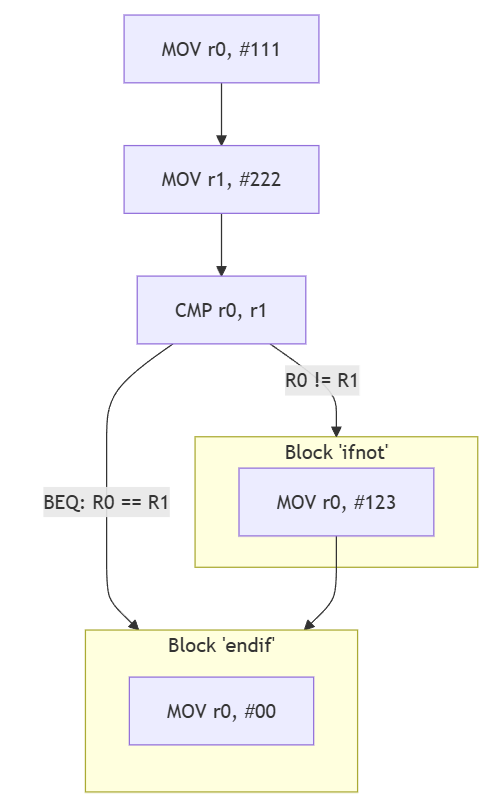
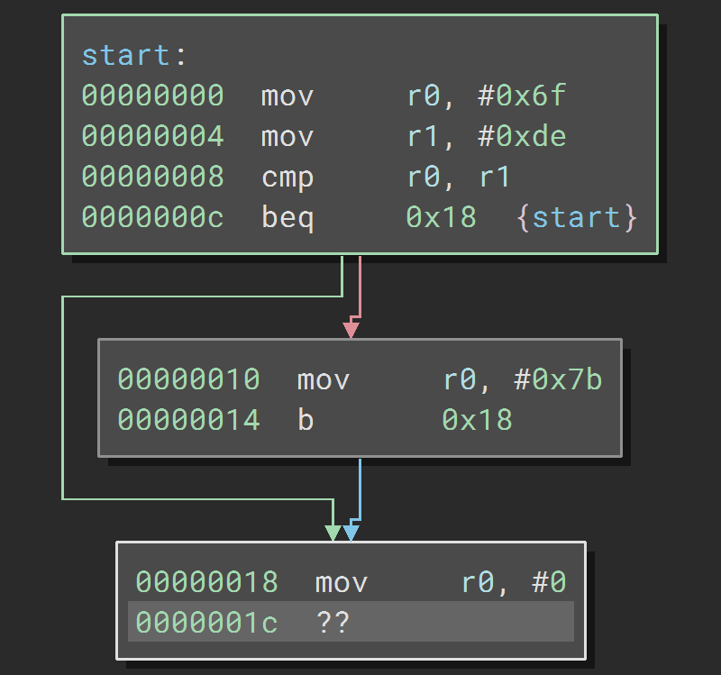

## If-not-then

In Assembler ist die simpelste Kontrollstruktur ein if-not-then. Sprich, wenn eine Bedingung nicht erfüllt ist, wird ein Codeabschnitt ausgeführt, anderenfalls wird er übersprungen.

#### Der Pseudocode für diese Kontrollstruktur ist folgender: 
```
if not(Condition) then do ...
```
#### Beispiel in ARM-Assembler:
```asm
start:
        MOV r0, #111  @ Beispielwert 1
        MOV r1, #222  @ Beispielwert 2
@ Kontrollstruktur if not...then...
        CMP r0, r1    @ check(r0 == r1)
        BEQ endif
ifnot:                @ Wenn Condition == false
        MOV r0, #123
        B endif
@ Ende der Kontrollstruktur
endif:
        MOV r0, #00
```

#### Der Kontrollflussgraph zum Beispiel:



#### Betrachtet man den Controlflow-graph dieser Kontrollstruktur in einem Disassembler, ergibt sich folgendes Bild:



[weiter](ifelse.md) 