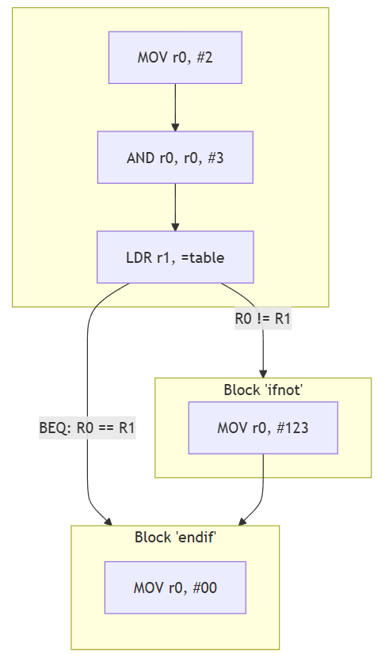

# A.3 Verknüpfungen von Basic Blocks
## 3.2.2 Kontrollstrukturen: If-not-then

In Assembler ist die simpelste Kontrollstruktur ein if-not-then. Sprich, wenn eine Bedingung nicht erfüllt ist, wird ein Codeabschnitt ausgeführt, anderenfalls wird er übersprungen.

### Der Pseudocode für diese Kontrollstruktur ist folgender: 
```
if not(Condition) then do ...
```
### Beispiel in ARM-Assembler:
```asm
start:
        MOV r0, #111    @ Beispielwert 1
        MOV r1, #222    @ Beispielwert 2

@ Kontrollstruktur if not...then...
        CMP r0, r1      @ check(r0 == r1)
        BEQ endif

ifnot:                  @ Wenn Condition == false
        MOV r0, #123
        B endif

@ Ende der Kontrollstruktur
endif:
        MOV r0, #00
```

#### Der Kontrollflussgraph zum Beispiel:



#### Betrachtet man den Controlflow-graph dieser Kontrollstruktur in einem Disassembler, ergibt sich folgendes Bild:


|----------------------------|------------------------------------|--------------------------|
|   [zurück](ctrlstrcts.md)  |   [Hauptmenü](../ueberblick.md)    |   [weiter](ifelse.md)    |


| **3.2 Kontrollstrukturen**                                            |
|-----------------------------------------------------------------------|
| [3.2.1 Intro](../ctrlstrukturen/ctrlstrcts.md)                        |
| [3.2.2 If-not-then](../ctrlstrukturen/ifnotthen.md)                   |
| [3.2.3 If-elseIf-then](../ctrlstrukturen/ifelse.md)                   |
| [3.2.4 If-then elseif-then](../ctrlstrukturen/If-then_elseif-then.md) |
| [3.2.5 Switch-Case](../ctrlstrukturen/switchcase.md)                  |
| [3.2.6 While-Schleifen](../ctrlstrukturen/while.md)                   |
| [3.2.7 Do-While-Schleifen](../ctrlstrukturen/do_while.md)             |
| [3.2.8 Zustandsautomaten](../Statemachine/Statemach.md)               |