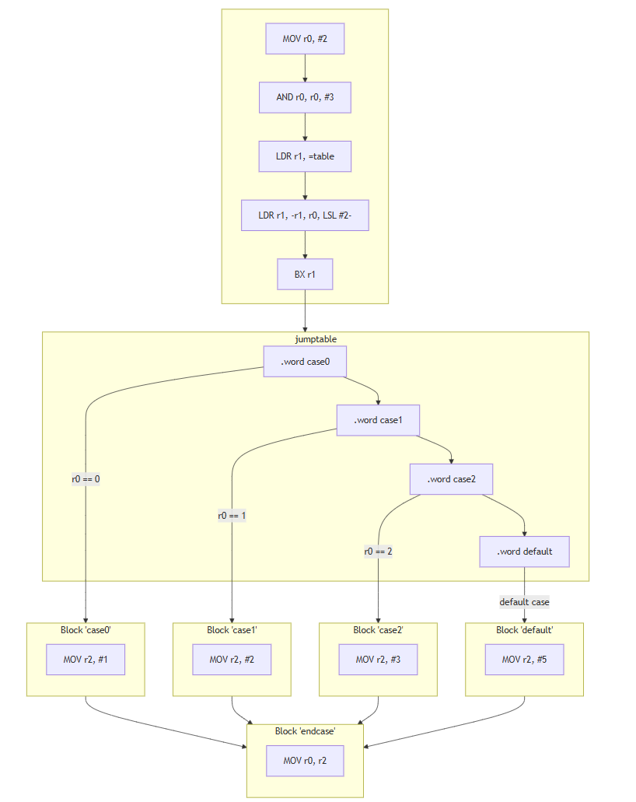

# A.3 Verknüpfungen von Basic Blocks
## 3.2.5 Kontrollstrukturen: Switch-Case

Ein `switch case` ist eine Kontrollstruktur, die es ermöglicht, eine Variable oder einen Ausdruck mit mehreren möglichen Werten zu vergleichen. Basierend auf dem Wert wird der entsprechende Fall (Case) ausgewählt und dessen Anweisungen ausgeführt. Diese Struktur ermöglicht eine effiziente und übersichtliche Handhabung von mehreren Bedingungen im Vergleich zu einer langen Kette von `if-else`-Anweisungen.
```
case(X)
 0:       statement 0; break;
 1:       statement 1; break;
 2:       statement 2; break;
 default: statement 3; break;

```
**Wichtig: X darf nicht größer als Anzahl cases sein, es liegt am Programmierer dies zu gewährleisten!**

### Switch case in Assembler
In Assembler wird die `switch-case`-Struktur durch indirekte Sprünge effizient umgesetzt. Ein indirekter Sprung ist ein Sprungbefehl, bei dem die Zieladresse nicht direkt angegeben ist. Stattdessen wird die Adresse in einem Register oder Speicherort gespeichert, und der Sprung erfolgt zur in diesem Register oder in dem Speicherort angegebenen Adresse. 
Anstelle einer ineffizienten, linearen Reihe von Vergleichen wie bei `if-else`, bei denen jede Bedingung nacheinander geprüft wird, wird bei `switch-case` ein Sprungtabelle verwendet. 
Diese Tabelle enthält Adressen zu den verschiedenen `case`-Labels. Die Implementierung erfolgt typischerweise so:

1. Der Wert, der überprüft werden soll, wird als Index verwendet, um den entsprechenden Fall in der Tabelle auszuwählen.
 Der Index wird verrechnet mit der Breite von Maschinenbefehlen bei ARM (* 4). Das Produkt davon dient als Offset in eine Sprungtabelle
2. Eine Sprungtabelle mit Adressen zu den `case`-Labels wird erstellt.
3. Der Wert wird genutzt, um in der Tabelle die Adresse des entsprechenden Codeblocks zu finden.
4. Ein indirekter Sprung (`BX`) wird verwendet, um direkt zum passenden Codeblock zu springen.


#### Beispiel in ARM-Assembler:
```asm 
.data
table:  .word case0
        .word case1
        .word case2
        .word default
```
Eine Sprungtabelle wie diese funktioniert, indem sie eine Liste von Adressen (Sprungziele) enthält, die den Code für verschiedene cases repräsentieren.

```asm 
.text
start:
        MOV r0, #2           @ r0 = X
        
    @ CASE(X) 
        AND r0, r0, #3
        LDR r1, =table
        LDR r1, [r1, r0, LSL #2]
        BX  r1
case0:
        MOV r2, #1
        B endcase
case1:
        MOV r2, #2
        B endcase
case2:
        MOV r2, #3
        B endcase
default:
       MOV r2, #5
endcase:
        MOV r0, r2
...
```
**Erklärung des Sprungbefehls**
```asm
LDR r1, [r1, r0, LSL #2]
BX  r1
```
**r1:** enthält die Basisadresse der Sprungtabelle.

**r0:** ist der Index, der mit **LSL #2** multipliziert wird, um auf das richtige Wort in der Tabelle zuzugreifen. Der Index wird mit 4 multipliziert, weil jede Adresse in der Sprungtabelle 4 Bytes groß ist. Die Multiplikation stellt sicher, dass man den richtigen Speicherplatz für das gewünschte Element in der Tabelle trifft, da die Tabelle sequentiell in 4-Byte-Schritten angeordnet ist.

**LDR r1, [r1, r0, LSL #2]:** gibt somit an, dass die effektive Adresse durch Hinzufügen des verschobenen Werts von r0 zur Basisadresse in r1 gebildet wird, anschließend wird diese Adresse in r1 geladen. 

**BX r1** führt einen bedingungslosen Sprung zur Adresse aus, die in r1 steht.

**Alternativ hätte man dem Sprung auch in einer Zeile realisieren können:**
``` 
LDR pc, [r1, r0, LSL #2]
```

#### Der Kontrollflussgraph zum Beispiel:



|-------------------------------------|------------------------------------|-------------------------|
|   [zurück](If-then_elseif-then.md)  |   [Hauptmenü](../ueberblick.md)    |   [weiter](while.md)    |


| **3.2 Kontrollstrukturen**                                            |
|-----------------------------------------------------------------------|
| [3.2.1 Intro](../ctrlstrukturen/ctrlstrcts.md)                        |
| [3.2.2 If-not-then](../ctrlstrukturen/ifnotthen.md)                   |
| [3.2.3 If-elseIf-then](../ctrlstrukturen/ifelse.md)                   |
| [3.2.4 If-then elseif-then](../ctrlstrukturen/If-then_elseif-then.md) |
| [3.2.5 Switch-Case](../ctrlstrukturen/switchcase.md)                  |
| [3.2.6 While-Schleifen](../ctrlstrukturen/while.md)                   |
| [3.2.7 Do-While-Schleifen](../ctrlstrukturen/do_while.md)             |
| [3.2.8 Zustandsautomaten](../Statemachine/Statemach.md)               |