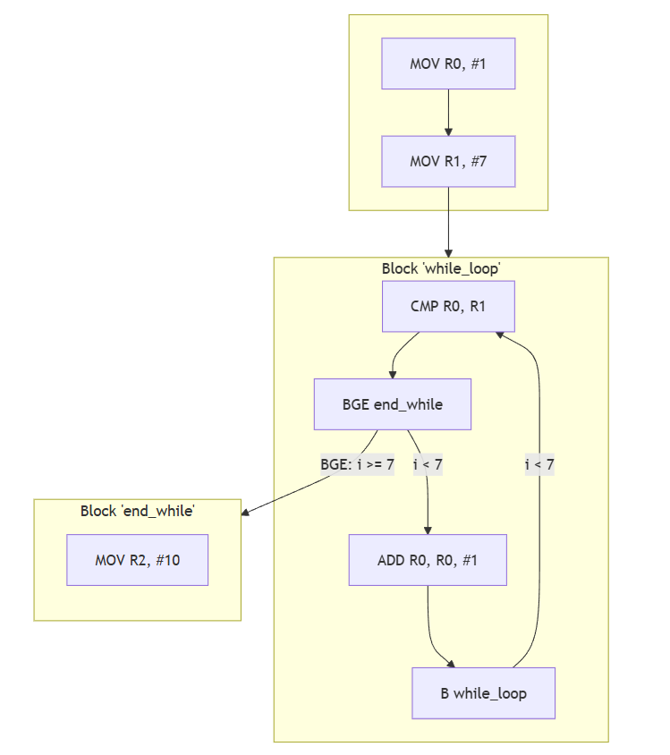

# A.3 Verknüpfungen von Basic Blocks
## 3.2.6 Kontrollstrukturen: While-Schleifen

Die `while-Schleife` ist eine kopfgesteuerte Schleife, bei der die Bedingung vor der ersten Ausführung des Schleifeninhalts geprüft wird. Das heißt, dass der Inhalt nur ausgeführt wird, wenn die Bedingung zum Ausführen wahr ist, ansonsten wird die Schleife verlassen.

### Kopfgesteuerte Schleife 


### Pseudocode:
```
while (i < limit): i = i + 1 
```

### Beispiel in ARM-Assembler:
```
    MOV R0, #1          @ i = 1
    MOV R1, #7          @ Setze die Obergrenze (7 für i < 7)

while_loop:
    CMP R0, R1          @ Vergleiche i mit der Obergrenze (R0-R1)
    BGE end_while       @ Wenn i >= 7, springe aus der Schleife
    ADD R0, R0, #1      @ i++, falls i < 7
    B while_loop        @ Springe zurück zum Schleifenanfang

end_while:
    MOV R2, #10         @ Programmende
```
Dieser Code implementiert eine `while-Schleife`, die die Variable `i` von 1 bis 6 hochzählt. Solange `i` kleiner als 7 ist, wird `i` um 1 erhöht. Sobald `i` den Wert 7 erreicht oder überschreitet, wird die Schleife verlassen und das Programm beendet.

### Der Kontrollflussgraph zum Beispiel



|----------------------------|------------------------------------|----------------------------|
|   [zurück](switchcase.md)  |   [Hauptmenü](../ueberblick.md)    |   [weiter](do_while.md)    |


| **3.2 Kontrollstrukturen**                                            |
|-----------------------------------------------------------------------|
| [3.2.1 Intro](../ctrlstrukturen/ctrlstrcts.md)                        |
| [3.2.2 If-not-then](../ctrlstrukturen/ifnotthen.md)                   |
| [3.2.3 If-elseIf-then](../ctrlstrukturen/ifelse.md)                   |
| [3.2.4 If-then elseif-then](../ctrlstrukturen/If-then_elseif-then.md) |
| [3.2.5 Switch-Case](../ctrlstrukturen/switchcase.md)                  |
| [3.2.6 While-Schleifen](../ctrlstrukturen/while.md)                   |
| [3.2.7 Do-While-Schleifen](../ctrlstrukturen/do_while.md)             |
| [3.2.8 Zustandsautomaten](../Statemachine/Statemach.md)               |