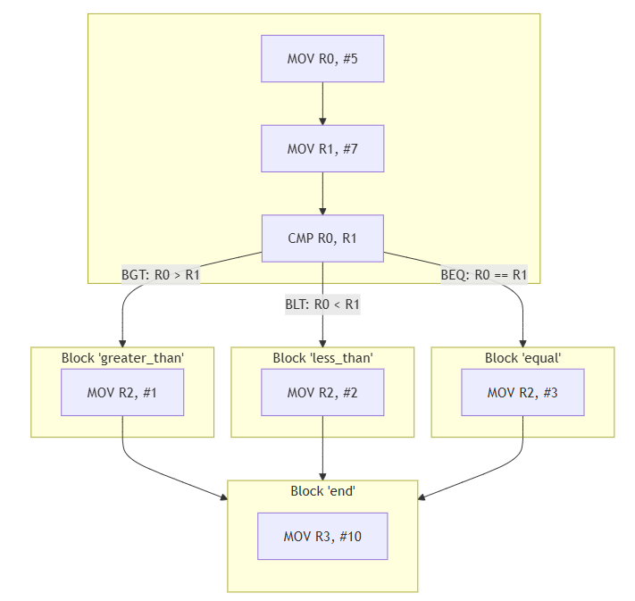

# A.3 Verknüpfungen von Basic Blocks
## 3.1.3 Kontrollflussinstruktionen: Bedingte Sprünge

Bedingte Sprünge sind etwas komplexer. Sie führen nur dann einen Sprung aus, wenn eine bestimmte Bedingung erfüllt ist. Diese Bedingung basiert auf Status-Flags, die durch vorherige Operationen von der ALU gesetzt wurden. Diese bedingten Sprünge ermöglichen es dem Programm, verschiedene Codepfade abhängig von bestimmten Bedingungen oder Ergebnissen zu verfolgen, was eine flexible und dynamische Steuerung des Programms ermöglicht.

### Syntax
```
B<condition> <label>
```
- B steht für "Branch" (Sprung).
- `<condition>` gibt die Bedingung an, unter der der Sprung erfolgen soll
- `<label>` ist das Ziel, zu dem gesprungen wird, wenn die Bedingung erfüllt ist

### Beispiel
Wenn eine bedingte Sprunganweisung ausgeführt wird, überprüft der Prozessor die Statusflags im CPSR. Falls die angegebene Bedingung erfüllt ist, wird der Sprung zu dem spezifizierten Label durchgeführt. Andernfalls wird die nächste Anweisung im Code ausgeführt.

```
    MOV R0, #5           @ Speichere die Zahl 5 in Register R0
    MOV R1, #7           @ Speichere die Zahl 7 in Register R1
    CMP R0, R1           @ Vergleiche R0 und R1 (5-7)

    BGT greater_than     @ Springe zu 'greater_than', wenn R0 > R1 (Z = 0, N = V)
    BLT less_than        @ Springe zu 'less_than', wenn R0 < R1 (N != V)
    BEQ equal            @ Springe zu 'equal', wenn R0 == R1 (Z = 1)

greater_than:
    MOV R2, #1           @ Wenn R0 > R1, speichere 1 in R2
    B end                @ Springe zum Ende

less_than:
    MOV R2, #2           @ Wenn R0 < R1, speichere 2 in R2
    B end                @ Springe zum Ende

equal:
    MOV R2, #3           @ Wenn R0 == R1, speichere 3 in R2

end:
    MOV R3, #10          @ Programmende
```

#### Der Kontrollflussgraph zum Beispiel



|-------------------------------|------------------------------------|--------------------------|
|   [zurück](unbedingtespr.md)  |   [Hauptmenü](../ueberblick.md)    |   [weiter](ctrlue.md)    |


| **3.1 Kontrollflussinstruktionen**                                    |
|-----------------------------------------------------------------------|
| [3.1.1 Intro](ctrlflow.md)                                            |
| [3.1.2 Unbedingte Sprünge](unbedingtespr.md)                          |
| [3.1.3 Bedingte Sprünge](bedingtespr.md)                              |
| [3.1.4 Manipulation des Programmcounters (Übungsaufgabe)](ctrlue.md)	|