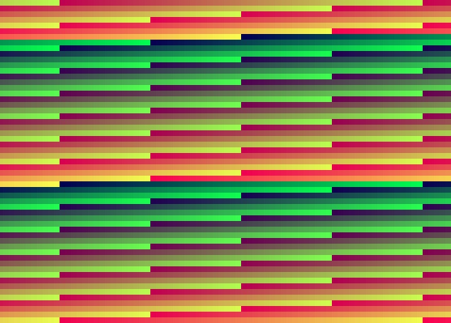

# B.3 Implementierung systemnaher Funktionen
## 3.1.4 Systemnahe Funktionen:  Grundlegende Grafikbibliothek Aufgaben

Entwickeln Sie eine Grafikbibliothek zur Verwaltung und Darstellung von Grafiken auf einem Bildschirm. Die Bibliothek soll das Setzen einzelner Pixel, das Füllen des gesamten Bildschirms mit einer Farbe sowie die Umrechnung von Benutzerkoordinaten in Bildschirmkoordinaten ermöglichen. Erstellen sie dazu das Sourcefile `canvas.s`. 

In grafischen Anwendungen ist es essenziell, dass Benutzerkoordinaten (z.B. Mauspositionen oder grafische Objekte) präzise in Bildschirmkoordinaten umgerechnet werden. Dies gewährleistet eine bedienungsfreundliche Platzierung und Darstellung von Grafikelementen auf dem Bildschirm. Ein "Canvas" dient dabei als virtuelles Zeichenfeld, auf dem Grafiken gezeichnet werden können, bevor sie auf den tatsächlichen Bildschirm übertragen werden. Durch die Umrechnung der Koordinaten kann eine flexible und benutzerfreundliche Interaktion mit der grafischen Oberfläche erreicht werden.

Überlegen sie sich im Anschluss Möglichkeiten die Grafikfunktionen ausgiebig zu testen, in dem sie etwa wie abgebildet mit den RGB-Farben experimentieren:

 

**Anforderungen:**

1. **Framebuffer-Initialisierung:**
   - Implementieren Sie eine Funktion `canvas_init`, die einen Framebuffer für die Bildschirmausgabe initialisiert. Diese Funktion soll die Bildschirmauflösung und Farbtiefe festlegen und die Basisadresse des Framebuffers speichern. Bei einem Fehler während der Initialisierung soll eine geeignete Fehlermeldung ausgegeben werden.

2. **Pixel setzen:**
   - Entwickeln Sie eine Funktion `put_pixel`, die es ermöglicht, einen einzelnen Pixel an den angegebenen Benutzerkoordinaten mit einer bestimmten Farbe zu setzen. Diese Funktion soll sicherstellen, dass die angegebenen Koordinaten innerhalb der Bildschirmgrenzen liegen und die Umrechnung in Bildschirmkoordinaten korrekt erfolgt.

3. **Bildschirm füllen:**
   - Implementieren Sie die Funktion `fillscreen`, die den gesamten Bildschirm mit einer angegebenen Hintergrundfarbe füllt. Diese Funktion soll effizient alle Pixel des Framebuffers mit der gewählten Farbe aktualisieren.

4. **Koordinatenumrechnung:**
   - Entwickeln Sie die Funktionen `get_canv_x` und `get_canv_y`, die Benutzerkoordinaten in das Canvas-Koordinatensystem umrechnen. Das Canvas-Koordinatensystem soll so definiert sein, dass der Ursprung oben links liegt, während die Benutzerkoordinaten einen anderen Referenzpunkt (z.B. Bildschirmmittelpunkt) haben können.

**Schnittstellen:**

- **`canvas_init`**
  - **Parameter:** Keine
  - **Rückgabewert:** Erfolg (`0`) oder Fehlercode (`-1`)

- **`put_pixel`**
  - **Parameter:**
    - `r1` – Benutzer-x-Koordinate
    - `r2` – Benutzer-y-Koordinate
    - `r3` – Farbe des Pixels
  - **Rückgabewert:** Keine

- **`fillscreen`**
  - **Parameter:**
    - `r1` – Hintergrundfarbe
  - **Rückgabewert:** Keine

- **`get_canv_x`**
  - **Parameter:**
    - `r1` – Benutzer-x-Koordinate
  - **Rückgabewert:**
    - `r0` – Umgerechnete Canvas-x-Koordinate

- **`get_canv_y`**
  - **Parameter:**
    - `r1` – Benutzer-y-Koordinate
  - **Rückgabewert:**
    - `r0` – Umgerechnete Canvas-y-Koordinate

- **`canvas_put_pixel`**
- **Parameter:**
  - `r1` – Canvas-x-Koordinate
  - `r2` – Canvas-y-Koordinate
  - `r3` – Farbe des Pixels
- **Rückgabewert:** Keine

|----------------------------|------------------------------------|------------------------------|
|   [zurück](formatlsg.md)   |   [Hauptmenü](../ueberblick.md)    |   [weiter](canvas_lsg.md)    |

|**3.1 Systemnahe Funktionen**                                                                  |
|-----------------------------------------------------------------------------------------------|
| [3.1.1 Implementierung systemnaher Funktionen](sysfunkintro.md)                               |
| [3.1.2 Implementierung von Speicherfunktionen in ARM-Assembly](memue.md)                      |
| [3.1.3 Implementierung von Zahlendarstellungsfunktionen](format_ue.md)                        |
| [3.1.4 Grundlegende Grafikbibliothek](canvas_ue.md)                                           |
| [3.1.5 Implementierung von Funktionen zur Verwaltung des Textmodus](textmode_ue.md)           |
| [3.1.6 Textdarstellung via Textmode](text_ue.md)                                              |
| [3.1.7 Implementierung einer `kwrite`-Funktion](kwrite_ue.md)                                 |
| [3.1.8 Implementierung einer Eingabefunktion](kread_ue.md)                                    |
| [3.1.9 Implementierung einer formatierenden Ausgabefunktion in ARM-Assembly](kprintf_ue.md)   |
| [3.1.10 Implementiere `kscan` für formatiertes Einlesen](kscan_ue.md)                         |

