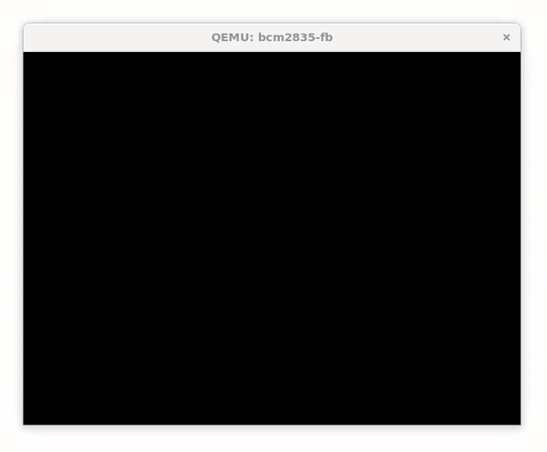

# B.3 Implementierung systemnaher Funktionen
## 3.1.1 Implementierung systemnaher Funktionen

Systemnahe Funktionen sind grundlegende Bausteine, die es uns ermöglichen, direkt mit der Hardware zu arbeiten, ohne jedes Mal die technischen Details der Hardware verstehen zu müssen. Diese Funktionen bilden eine wichtige Schicht, die die Komplexität der Hardware für uns vereinfacht und es ermöglicht, darauf aufbauend größere Programme zu entwickeln.

Wir beginnen mit der Implementierung von Funktionen zur Speicherverwaltung. Danach werden wir uns mit der Umwandlung von Zahlen in lesbare Formate beschäftigen, was notwendig ist, um interne Daten benutzerfreundlich darzustellen. Anschließend werden wir einfache Grafik- und Textausgabefunktionen entwickeln, die es uns ermöglichen Text grafisch auf dem Bildschirm darzustellen.

### Hinweis zum weiteren Vorgehen

Haben Sie eine der in diesem Kapitel behandelten Funktionen implementiert, binden Sie diese in `main.s` ein und testen Sie diese gründlich mit Hilfe des Debuggers.

|-------------------------------|-------------------------------|----------------------|
| [zurück](../GPU/sendinit.md)  | [Hauptmenü](../ueberblick.md) | [weiter](memue.md)   |

|**3.1 Systemnahe Funktionen**                                                                  |
|-----------------------------------------------------------------------------------------------|
| [3.1.1 Implementierung systemnaher Funktionen](sysfunkintro.md)                               |
| [3.1.2 Implementierung von Speicherfunktionen in ARM-Assembly](memue.md)                      |
| [3.1.3 Implementierung von Zahlendarstellungsfunktionen](format_ue.md)                        |
| [3.1.4 Grundlegende Grafikbibliothek](canvas_ue.md)                                           |
| [3.1.5 Implementierung von Funktionen zur Verwaltung des Textmodus](textmode_ue.md)           |
| [3.1.6 Textdarstellung via Textmode](text_ue.md)                                              |
| [3.1.7 Implementierung einer `kwrite`-Funktion](kwrite_ue.md)                                 |
| [3.1.8 Implementierung einer Eingabefunktion](kread_ue.md)                                    |
| [3.1.9 Implementierung einer formatierenden Ausgabefunktion in ARM-Assembly](kprintf_ue.md)   |
| [3.1.10 Implementiere `kscan` für formatiertes Einlesen](kscan_ue.md)                         |