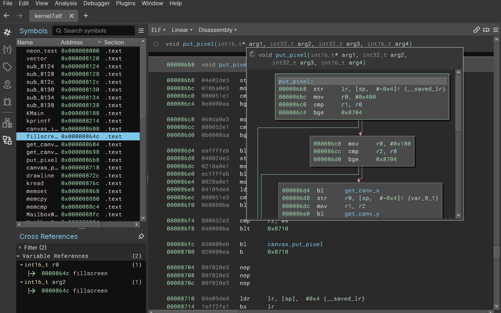

# A.1 Einführung
## 1.1.3 Was ist ein Programm: Was ist denn nun ein "Disassembler"?

Ein Disassembler ist ein Werkzeug, das Maschinencode in Assembler rückübersetzt. Der Maschinencode, der von der CPU ausgeführt wird, wird durch den **Disassembler** in lesbare Assembler-Befehle umgewandelt. Dieser Maschinencode entsteht durch das Kompilieren eines Programms, bei dem der Quellcode aus einer höheren Programmiersprache wie C in binäre Anweisungen umgewandelt wird, die die CPU direkt versteht. Der Disassembler macht es möglich, den genauen Ablauf eines Programms nachzuvollziehen, was besonders nützlich ist, wenn der Quellcode nicht verfügbar ist, etwa zur Analyse von Schadsoftware oder zur Fehlersuche in bestehenden Programmen.

### Was ist ein Controlflowgraph?
Ein Control Flow Graph (CFG) ist eine grafische Darstellung des Kontrollflusses innerhalb eines Programms. Er zeigt, wie die verschiedenen Anweisungen und Blöcke im Programm miteinander verbunden sind, und stellt insbesondere Verzweigungen, Schleifen und Sprünge dar. Ein CFG wird häufig in der sogenannten "statischen Analyse" verwendet, um die Struktur eines Programms zu verstehen und potenzielle Schwachstellen oder Optimierungsmöglichkeiten zu identifizieren.

|-----------------------|-------------------------------|------------------------------------------|
| [zurück](mehrals.md)  | [Hauptmenü](../ueberblick.md) | [weiter](../einführungarch/cpuintro.md)  | 

| **1.1 Was ist ein Programm?**                                                             |
|-------------------------------------------------------------------------------------------| 
| [1.1.1 Intro](../wasistprog/wasistprog.md)                                                |
| [1.1.2 Mehr als ein Gedankenspiel](../wasistprog/mehrals.md)                              | 
| [1.1.3 Was ist denn nun ein "Disassembler"?](../wasistprog/disasm.md)                     |