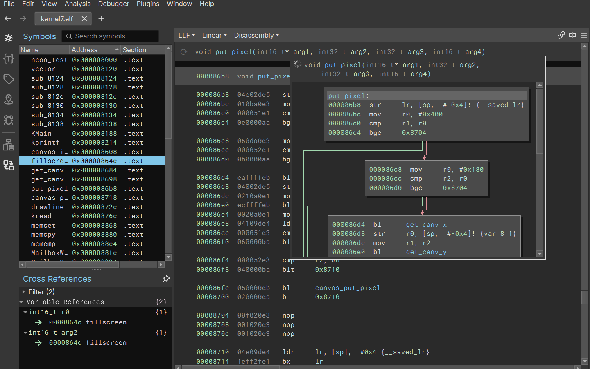

## Was ist denn nun ein "Disassembler"?
Ein Disassembler ist ein Werkzeug, das Maschinencode in Assembler rückübersetzt.
Der ursprüngliche Quellcode, der in einer höheren Programmiersprache wie C oder Python geschrieben sein kann, wird durch den Disassembler in die kompilierten, binären Anweisungen in ihre Assembler-Befehle zerlegt. Dadurch wird es möglich, den genauen Ablauf eines Programms nachzuvollziehen, was besonders nützlich ist, wenn der Quellcode nicht verfügbar ist, etwa zur Analyse von Schadsoftware oder zur Fehlersuche in bestehenden Programmen.

### Was ist ein Controlflowgraph?
Ein Control Flow Graph (CFG) ist eine grafische Darstellung des Kontrollflusses innerhalb eines Programms. Er zeigt, wie die verschiedenen Anweisungen und Blöcke im Programm miteinander verbunden sind, und stellt insbesondere Verzweigungen, Schleifen und Sprünge dar. Ein CFG wird häufig in der sogenannten "statischen Analyse" verwendet, um die Struktur eines Programms zu verstehen und potenzielle Schwachstellen oder Optimierungsmöglichkeiten zu identifizieren.

|-----------------------|-------------------------------|------------------------------------------|
| [zurück](mehrals.md)  | [Hauptmenü](../ueberblick.md) | [weiter](../einführungarch/cpuintro.md) | 