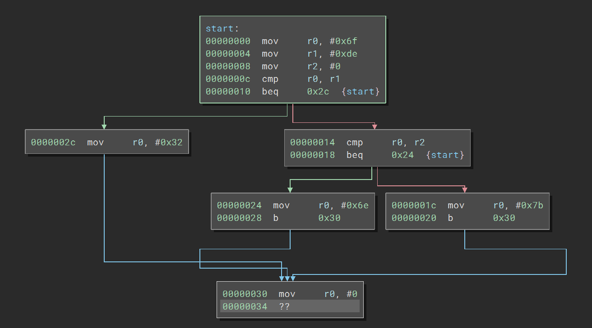

# A.1 Einführung
## 1.1.2 Was ist ein Programm: Mehr als ein Gedankenspiel

Programme auf diese Weise zu betrachten, ist nicht bloss als abstrakte Betrachtung ein Hilfsmittel für denjenigen, der gerade seine ersten Schritte als Assemblerprogrammierer macht, sondern es spiegelt eine ganz grundlegende Eigenschaft von Programmen wider. Dies merkt man, wenn man ein Programm, in welcher Programmiersprache auch immer geschrieben - disassembliert und einen Controlflowgraph vom Disassembler anfertigen lässt:

|-------------------------|-------------------------------|----------------------|
| [zurück](wasistprog.md) | [Hauptmenü](../ueberblick.md) | [weiter](disasm.md)  | 

| **1.1 Was ist ein Programm?**                                                             |
|-------------------------------------------------------------------------------------------| 
| [1.1.1 Intro](../wasistprog/wasistprog.md)                                                |
| [1.1.2 Mehr als ein Gedankenspiel](../wasistprog/mehrals.md)                              | 
| [1.1.3 Was ist denn nun ein "Disassembler"?](../wasistprog/disasm.md)                     |